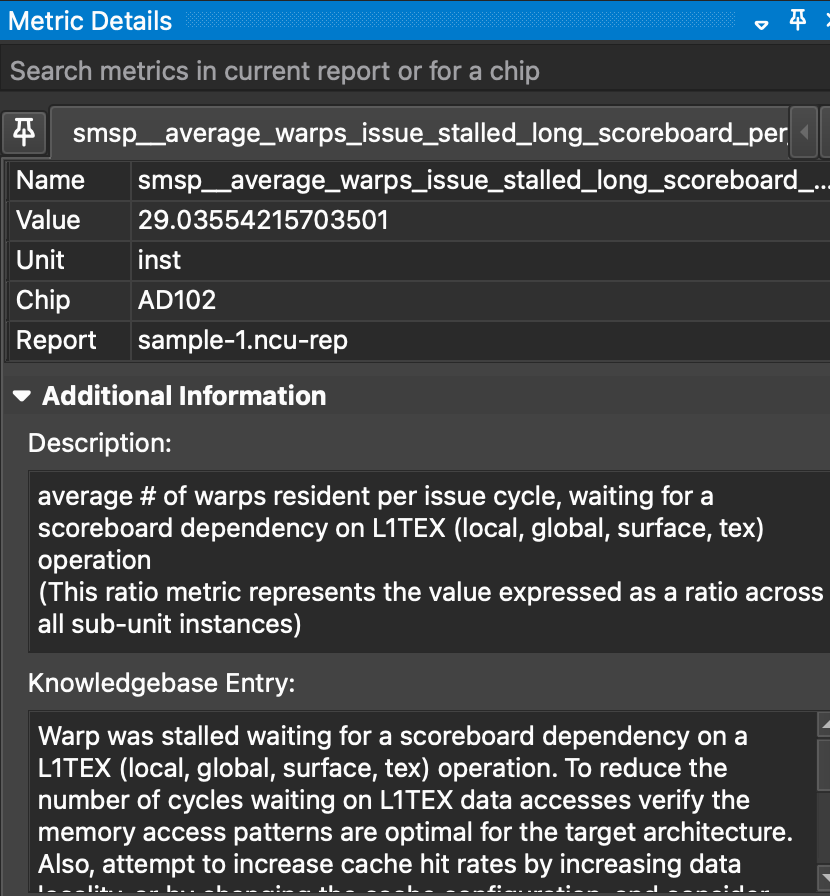

# Six basic performance advices for porting kernels to the GPU.

## 0. Introduction
### Some context and motivations

Hello world ! This is my first blog post. I'm Rémi Bourgeois, PhD. I am a researcher engineer working at the French Atomic Energy Comission (CEA). I work on the [TRUST platform](https://cea-trust-platform.github.io/), a HPC (multi-GPU) CFD code that serves as a basis for many research/industrial applications.

I was hired by CEA to join the porting effort of this legacy code to the GPU using [Kokkos](https://github.com/kokkos/kokkos). This is quite a challenging task as the code is 20 years old, and more than 1400 kernels were identified to be ported to the GPU ! As I went and optimized some kernels, something struck me:

**The nature of the task of porting code to the GPU, especially when time is limited, often lead to small mistakes that can undermine performance.**

The goal of this blogpost is to give you *basic*, easy tips to keep in mind when writing / porting / first optimizing your kernels, so that you get a *reasonable* performance.

By applying them, I was able to get the following speedups that are measured relative to an already GPU-enabled baseline:

- A 40-50% speedup on a CFD [convection kernel](https://github.com/cea-trust-platform/trust-code/blob/509d09ae94bc5189131c6f160f1d42f6024cfa98/src/VEF/Operateurs/Op_Conv/Op_Conv_VEF_Face.cpp#L473) from TRUST (obtained on RTX A5000, RTX A6000 Ada and H100 GPUs). **Brace yourself**: this is a monstruous kernel.
- A 20-50% speedup on a CFD [diffusion kernel](https://github.com/cea-trust-platform/trust-code/blob/509d09ae94bc5189131c6f160f1d42f6024cfa98/src/VEF/Operateurs/Op_Diff_Dift/Op_Dift_VEF_Face_Gen.tpp#L192) from TRUST (obtained on RTX A6000 Ada and H100 GPUs).
- A 20% speedup on a [MUSCL reconstruction kernel](https://github.com/Maison-de-la-Simulation/heraclespp/blob/54feb467f046cf21bdca5cfa679b453961ea8d7e/src/hydro/limited_linear_reconstruction.hpp#L54) from the radiative hydrodynamics code [heraclescpp](https://github.com/Maison-de-la-Simulation/heraclespp) (obtained on a A100 GPU)
- TODO: add ncu reports
  
By *reasonable* I do not mean that you will get *optimal* performance. In fact, I will not go over what I consider to be *advanced* optimization advices such as the use of 

- [`shared memory`](https://www.youtube.com/watch?v=A1EkI5t_CJI&t=5s), 
- [vectorized operations](https://developer.nvidia.com/blog/cuda-pro-tip-increase-performance-with-vectorized-memory-access/),
- [tensor cores operations](https://developer.nvidia.com/blog/optimizing-gpu-performance-tensor-cores/),
- [hardware-specific optimizations](https://www.nvidia.com/en-us/on-demand/session/gtc25-s72683/?playlistId=playList-600dacf3-7db9-45fe-b0a2-e0156a792bc5). 
  
If getting  *optimal* performance is crucial to your application, consider learning more and apply these, but keep in mind that **performance often comes at the cost of portability**.
The advices are general enough so that they should allow speedups on all cards from all vendors.  By *advanced*, I do not mean that these topics are especially difficult or out of reach, but only that they require a significant design effort to be used effectively in a production context such as a wide CFD code like TRUST. In contrast, I believe that the advices I will give to you in this blogpost are easy enough so that you can, and should apply them straightforwardly while porting your code to the GPU in a time limited environement. 

**Note 1:** The target audience is engineer / researcher that want to get started with GPU porting in a code that relies on custom, domain specific low-level kernel. But do not reinvent the wheel ! i.e. do not rewrite kernels that have been implemented, hihgly optimized and distributed in libraries. Consider looking into (non exhaustive list !):

- [CUDA Libraries](https://docs.nvidia.com/cuda-libraries/index.html).
- [kokkos kernels](https://github.com/kokkos/kokkos-kernels) for portable BLAS, sparse BLAS and fraph kernels.
- [Trilinos](https://trilinos.github.io/) for high level, portable solutions for the solution of large-scale, complex multi-physics engineering and scientific problems.
- [PETSc](https://petsc.org/release/) for the scalable solution of scientific applications modeled by partial differential equations (PDEs)

### Disclaimers

If you think I wrote something that is wrong, or misleading please let me know !

I am running my performance tests on Nvidia GPUs, just because they are more easily available to me, and that I am more familiar with the performance tools such as [nsight systems](https://developer.nvidia.com/nsight-systems) (nsys) and [nsight compute](https://developer.nvidia.com/nsight-compute) (ncu). However, note that AMD provides similar profilers, and that the advices that I give here are simple enought so that they apply for GPUs from both vendors.

Moreover, I will use Kokkos as the programming model, just because I work with it, and that performance portability is **cool**. Again, the concepts are simple enought so that you can translate them to your favorite programming model, OpenMP, SYCL, Cuda, Hip.

### Pre-requisits

In this small tutorial, I will assume that you are already familiar with / will not cover:

- Basic C++.
- The reason why you might want to use the GPU, and that you need a big enough problem to make full use of it.
- How to Compile a GPU code, generate a report with [Nvidia nsight compute](https://youtu.be/04dJ-aePYpE?si=wTO9vJsRmVMBfM8a) and loading in with the ui.
- What is Kokkos, why you might want to use it and how to get started with it. Some ressources:
    - [Talk by Christian Trott, Co-leader of the Kokkos core team](https://www.youtube.com/watch?v=y3HHBl4kV7g).
    - [Kokkos lecture series](https://www.youtube.com/watch?v=rUIcWtFU5qM&list=PLqtSvL1MDrdFgDYpITs7aQAH9vkrs6TOF) (kind of outdated, but you can find a lot of ressources online, alos, join the slack !).
    -  **Note:** you really *should* consider using Kokkos, or any other portable programming model. It's good enough so that CEA adopted it for it's legacy codes ! (see [the CExA project](https://cexa-project.org/)).
- Basic GPU architecture, in particular:
    - That you should avoid host to device memory transfers.
    - The roofline performance model.
    - What does compute bound / memory bound mean.
    - Some knowledge about the memory hierarchy (registers, L1/L2 caches, DRAM) and the increasing cost of memory accesses.
    - Some ressources on GPU architecture / CUDA programming:
        - [1h30 lecture by Athena Elfarou](https://www.nvidia.com/en-us/on-demand/session/gtc24-s62191/)
        - [13 lectures by Bob Crovella](https://www.youtube.com/watch?v=OsK8YFHTtNs&list=PL6RdenZrxrw-zNX7uuGppWETdxt_JxdMj)
- Application-level optimization:
    - How to build a sensible optimization roadmap with e.g. Nvidia Nsight System
    - How to ensure that it is worth it to optimize the kernel you are looking (Don't assume bottleneck, profile, assess, optimize).
    - Some ressouces:
        -  [8th lecture from the Bob Crovella lecture series](https://www.youtube.com/watch?v=nhTjq0P9uc8&list=PL6RdenZrxrw-zNX7uuGppWETdxt_JxdMj&index=8) which focuses on that topic.

### Outline

The outline for this post is the following 6 rules of thumbs,or advices, largely inspired by [the Nvidia Ampere tuning guide](https://docs.nvidia.com/cuda/ampere-tuning-guide/index.html):

1. Minimise redundant global memory accesses.
2. Ensure memory access are coalesced.
3. Minimize redundant math operation, use cheap arithmetics.
4. Understanding occupancy.
5. Avoid the use of *Local memory*.
6. Avoid thread divergence.

Feel free to jump straight into your sections of interest. TODO: i want also to giuve insight on where to look in ncu

### Before we start

Before going into the 6 advices, I invite you to read [my post on the cost of communications](post2.md) that is a good, unesseray long introduction for advices 1. and 2. I also strongly advise watching [this brilliant talk on communication-avoiding algorithms](https://www.youtube.com/watch?v=sY3bgirw--4). Moreover, all sample code and ncu reports can be [here](https://github.com/rbourgeois33/rbourgeois33.github.io/tree/code-sample/code-sample) along with compilation and execution instructions. The reports were ran on my [Nvidia RTX 6000 Ada generation](https://www.techpowerup.com/gpu-specs/rtx-6000-ada-generation.c3933) GPU.

## 1. Minimise redundant global memory accesses

As discussed in [my post on the cost of communications](post2.md), on recent GPUs (V/A/H/B100) it takes 50-100x more time to load a non cached FP64 double from global memory up to registers than computing a FMA math operation on that number. We call this ratio the **flop per load** (FPL). The cache hierachy does mitigates that number, but each and every access to global memory *is* more expensive than a register manipulation by a factor of at least 2-5x, assuming the variable is cached in L1. You should avoid them *at all cost*.

### A first simple example, temporary register storages
Let's considers at [sample-1.cpp](https://github.com/rbourgeois33/rbourgeois33.github.io/blob/code-sample/code-sample/sample-1.cpp) where we create two Device views:
TODO: préciser qu'une kokkos view c'est un vecteur sur le device
```c++
const int size = 1<<27;
Kokkos::View<float*> A("A", size);
Kokkos::View<float*> B("B", size);
```
and perform the following, rather silly, kernel,
```c++
Kokkos::parallel_for("Kernel", size, KOKKOS_LAMBDA(const int i) { 
    for (int k=0; k<10; k++){
        A(i) += B(i-1);
        A(i) += B(i);
        A(i) += B(i+1);
    }
});
```
The issue is probably already striking to you: each instance of `A(i) +=` is a global memory R/W. The solution is straightforward and found in [sample-1-fixed.cpp](https://github.com/rbourgeois33/rbourgeois33.github.io/blob/code-sample/code-sample/sample-1-fixed.cpp): use a temporary storage for `A`, and R/W only once per thread:

```c++
Kokkos::parallel_for("Kernel", size, KOKKOS_LAMBDA(const int i) { 
    float tmp=0;
    for (int k=0; k<10; k++){
        tmp += B(i-1);
        tmp += B(i);
        tmp += B(i+1);
    }
    A(i) += tmp;
});
```
**Note**: Since each thread uses the same values of B as it's neighbors, `shared memory` could be used to further improve performance. However, this kernel is simple enough so that caches probably already do a enough good job.

With this simple change, we went from 60R, 30W per thread to 31R, 1W. You might think that it is such an obvious thing to avoid that it is not even worth talking about it. But I disagree ! Often, when first porting to kokkos, in a time limited environment, we simply replace the e.g. `std::vector` by `Kokkos::View` in the kernel body, check functionnality and move onto the next kernel, resulting in this issue hindering performance. Moreover, for more very long, intricate kernels with many Views, spotting and   removing redundant memory accesses is quite tedious. Try for e.g. [this one](https://github.com/cea-trust-platform/trust-code/blob/509d09ae94bc5189131c6f160f1d42f6024cfa98/src/VEF/Operateurs/Op_Conv/Op_Conv_VEF_Face.cpp#L473).
### Profiler diagnosis
Let's look into the profiler report for the first sample code (Download it and load it in ncu ! Works even if you don't have a Nvidia GPU), [sample-1.ncu-rep](https://github.com/rbourgeois33/rbourgeois33.github.io/blob/code-sample/code-sample/sample-1.ncu-rep). First, let's look at the GPU SOL section:

**Figure 1:** GPU SOL section for sample-1.cpp.

We can see that the memory is heavily used. This begs the question, are we using it effectively ? Let's go to the memory workload analysis and dissect some elements

**Figure 2:** Memory workload analysis for sample-1.cpp.

- Memory Throughput [Gbyte/s] 308.75 
    - --> This is much lower than my GPU's bandwidth of 960.0,
- Communications between DRAM (Device Memory) and L2:
    - 1.07 GB reads, which corresponds to $2^{27}(size) \times 2 (\text{A and B}) \times 4 (\text{bytes per double})=1.07\times 10^9$ bytes. There is half as much writes, corresponding to A being modified. Both A and B are loaded once into the L2 cache, and A is written back only once into DRAM Good !
- Communications between L2 and L1:
    - About as much reads into L1, a little more probably due to cache misses. But, an astounding 9.14 GB of data written from L1 to L2, due to cache invalidations ! This  is a great hint of redundant memory accesses; a big discrepancy between expected and observed volumes of exchanges. Essentially, this is the cache that is working hard to save you from you own mistakes, by not writing back all the way to DRAM at each `A(i)+=`. It really is saving you, as if we switch to throuput view, we see that these excessinve writes are done at an astounding 1.89 TB/s, twice as fast as my GPU's bandwith !
  
Lastly, let's look at one of my favorite sections, the warp state statistics session, espacially the warp states:

**Figure 3:** Warp States for sample-1.cpp.
If you are not familiar with warps states, really consider looking at [the 1h30 lecture by Athena Elfarou](https://www.nvidia.com/en-us/on-demand/session/gtc24-s62191/). Essentially, a warp is a group of 32 threads (32 instances of the kernel with neigbouring index `i`). It can be either:

- Stalled: waiting on a dependancy: for instance, to perform `A(i)+=B(i)`, you need to wait that both values were loaded from global memory into the registers. This takes a while. You can also be waiting on a math operation to be done, a barrier, or the execution queue to have a spot.
- Eligible: available to be scheduled,
- Selected: will issue an instruction on the next cycle.
  
The warp states shows you the **reasons** why your warps have been stalled during the execution of your kernel, sorted by importance. This is precisely what you should worry about ! We see two reasons here with quite obscure names "Stall long scoreboard and Stall LG throttle". You can drag over your mouse onto the items to get an explanation, e.g. for the first one:

**Figure 4:** Metric information for Stall long scoreboard.

Stall long scoreboard means that warps are waiting on a memory dependancy from global memory, this not surprising and a very common one for memory bound kernels. Stall LG throttle means that the warps are waiting on the warp slot queue to have a spot to be scheduled. Indeed, each warp scheduler has a finite amount of spots for it's warps to be scheduled. If a kernel issues too many requests, warps are waiting, not on a dependancy, but simply on a spot in the queue. This is also a good symptom of redundant memory operations !

Let't now take a look at [sample-1-fixed.ncu-rep](https://github.com/rbourgeois33/rbourgeois33.github.io/blob/code-sample/code-sample/sample-1-fixed.ncu-rep). I recommend using the "add baseline" functionnality, so that we can track our progress ! First thing you can notice is that we get a huge performance gain: from 5.08ms to 1.81ms, a 64% speedup ! Then, going into the several sections:

- GPU Speed of light throuput:
    - The compute pipeline is less busy, I'm honestly not sure why.
    - The memory pipeline is more used (+6%)
  

**Figure 2:** Memory workload analysis for sample-1-fixed.cpp.

- Memory workload Analysis: 
    - The memory throuput is much closer to the theoretical peak (865 GB/s, +180%)
    - The previously healthy memory transfers are unchanged, but the L1 to L2 writes are reduced by 94%, as well as the caches hit rates. This shows that our cleaner implementation relies less on the caches, because it has much fewer redundant memory accesses.


<!-- We can see that the kernel uses both memory and compute pipelines extensively. The high value of memory usage is surprising; Each thread is performing a lot of math; around 30 FMA, but is is much lower than the FP32 FPL of the GPU I am working with (A [Nvidia RTX 6000 Ada generation](https://www.techpowerup.com/gpu-specs/rtx-6000-ada-generation.c3933), with a FP32 FPL of 379) -->
<!-- - 255.85M request between the kernel and global memory, split amongst ~130M Reads and ~130M Writes.
    - This corresponds to $2^{27}(30) -->
### Static arrays as temporary storages
Let's now consider a multi-dimensional case, with 2D Views and at least one run-time axis size, here, `dim`:

```c++
const int size = 1<<27;
int dim = 3;
Kokkos::View<float**> A("A", size, dim);
Kokkos::View<float**> B("B", size, dim);
```

and the following kernel from [sample-2.cpp](https://github.com/rbourgeois33/rbourgeois33.github.io/blob/code-sample/code-sample/sample-2.cpp):

```c++
Kokkos::parallel_for("Kernel", size, KOKKOS_LAMBDA(const int i) { 

    for (int k = 0; k < 10; k++){
        for (int dir = 0; dir < dim; dir++){
            for (int dir2 = 0; dir2 < dim; dir2++){
                A(i,dir) += B(i,dir2);
            }
        }
    }

});
```

It is clear that there are redundant memory accesses, that we would like to store in temporary arrays

## 2. Ensure memory access are coalesced
### Background
### Profiler diagnosis
### Advices
Think about your data Layout Kokkos layout conspiracy The granularity of memory accesses: lost bytes


## 3. Minimize redundant math operation, use cheap arithmetics
### Background
### Profiler diagnosis
### Advices
FMA, / vs *, unroll loop for int computation might need to template Math can be a bottleneck  Do smarter math

## 4. Understanding occupancy
### Background
### Profiler diagnosis
### Advices
Hide latency The occupancy trap, ILP, hide latency reduce Register usage
Reduce usage, launch bound, no MDRANGE, we dont talk about block and share memory limits, template away expensive branches

## 5. Avoid the use of *Local memory*
### Background
### Profiler diagnosis
### Advices
 Local memory is SLOW
Why does it spills + ref a la precedente section
How to avoid stack usage
attention aux tableaux statiques

## 6. Avoid thread divergence
### Background
### Profiler diagnosis
### Advices
The SIMD pattern, masking templating

## Final advices

Participate to hackathons !

