# Five basic performance advice for porting kernels to the GPU.
If you find this article useful, leave a thumbs up or a comment [below](#comments) !

_Last updated: {{ git_revision_date_localized }}_.  


## 0. Introduction
### Some context and motivations

I was hired by CEA to join the porting effort of the the legacy code [TRUST](https://cea-trust-platform.github.io/) to the GPU using [Kokkos](https://github.com/kokkos/kokkos). This is quite a challenging task as the code is 20 years old, and more than 1400 kernels were identified to be ported to the GPU! In this blog post, the term *kernel* refers to a single parallel loop, that fits in a so-called CUDA kernel, or equivalently within a `Kokkos::parallel_for`. As I went and optimized some kernels, something struck me:

**The nature of the task of porting kernels to the GPU, especially when time is limited, often leads to small mistakes that can undermine performance.**

The goal of this blog post is to give you *basic*, easy tips to keep in mind when writing / porting / first optimizing your kernels, so that you get a *reasonable* performance. By applying them, I was able to get the following speedups that are measured relative to an already GPU-enabled baseline:

- A 40-50% speedup on a CFD [convection kernel](https://github.com/cea-trust-platform/trust-code/blob/509d09ae94bc5189131c6f160f1d42f6024cfa98/src/VEF/Operateurs/Op_Conv/Op_Conv_VEF_Face.cpp#L473) from TRUST (obtained on RTX A5000, RTX A6000 Ada and H100 GPUs). **Brace yourself**: this is a monstrous kernel.
- A 20-50% speedup on a CFD [diffusion kernel](https://github.com/cea-trust-platform/trust-code/blob/509d09ae94bc5189131c6f160f1d42f6024cfa98/src/VEF/Operateurs/Op_Diff_Dift/Op_Dift_VEF_Face_Gen.tpp#L192) from TRUST (obtained on RTX A6000 Ada and H100 GPUs).
- A 20% speedup on a [MUSCL reconstruction kernel](https://github.com/Maison-de-la-Simulation/heraclespp/blob/54feb467f046cf21bdca5cfa679b453961ea8d7e/src/hydro/limited_linear_reconstruction.hpp#L54) from the radiative hydrodynamics code [heraclescpp](https://github.com/Maison-de-la-Simulation/heraclespp) (obtained on a A100 GPU).
  
I will not go over what I consider to be *advanced* optimization techniques such as:

- [shared memory](https://www.youtube.com/watch?v=A1EkI5t_CJI&t=5s),
- [vectorized memory access](https://developer.nvidia.com/blog/cuda-pro-tip-increase-performance-with-vectorized-memory-access/),
- [tensor core operations](https://developer.nvidia.com/blog/optimizing-gpu-performance-tensor-cores/),
- [hardware-specific optimizations](https://www.nvidia.com/en-us/on-demand/session/gtc25-s72683/?playlistId=playList-600dacf3-7db9-45fe-b0a2-e0156a792bc5),
- [warp-level primitives](https://developer.nvidia.com/blog/using-cuda-warp-level-primitives/).

Because they are not required to get reasonable performances on simple kernels such as the ones cited above. Indeed these kernels might be very verbose  but remains simple patterns like stencil operations or matrix filling. Moreover, these advanced optimizations require significant work to be deployed in large codes with hundreds of kernels, such as a CFD solver like TRUST. Keep in mind that maximum performance often comes at the cost of portability. The simple guidelines here should help you gain performance across all GPU platforms.

If you aim for *optimal* performance, or if you are tackling complex kernels such as the [single-pass parallel prefix scan with decoupled look-back](https://research.nvidia.com/sites/default/files/pubs/2016-03_Single-pass-Parallel-Prefix/nvr-2016-002.pdf), you will need to dive into those *advanced* topics. But please do not reinvent the wheel ! if a kernel or algorithm is already implemented, optimized, and distributed in a library, do not code it (Except for learning purposes!). Here is a non exhaustive sample:

- [CUDA Libraries](https://docs.Nvidia.com/cuda-libraries/index.html).
- [CUDA Core Compute Libraries](https://github.com/nvidia/cccl).
- [Kokkos kernels](https://github.com/kokkos/kokkos-kernels) for portable BLAS, sparse BLAS and graph kernels.
- [Trilinos](https://trilinos.github.io/) for high level, portable solutions for the solution of large-scale, complex multi-physics engineering and scientific problems.
- [PETSc](https://petsc.org/release/) for the scalable solution of scientific applications modeled by partial differential equations (PDEs).

Lastly, if you are in the process of optimizing/porting your code, and first learning about the GPU, you might want to start with the [CUDA C++ Best Practices Guide](https://docs.Nvidia.com/cuda/cuda-c-best-practices-guide/) as kernel-level optimization is too low level to start with. The right approach is to identify the hot spots of your code and focus on them first (Assess, Parallelize, Optimize, Deploy cycle).

### Prerequisites and recommandations

In this tutorial, I will assume that you are already familiar with:

- Basic C++.
- The reason why you might want to use the GPU, and that you need a big enough problem to make full use of it.
- Some understanding of GPU performance:
    - the roof-line performance model,
    - what does compute bound / memory bound mean.
- Basic GPU architecture, in particular:
    - Some knowledge of the memory hierarchy (registers, L1/L2 caches, DRAM) and the increasing cost of memory accesses. What are CUDA threads / blocks and global memory. *You can be confused about what is local memory*. [Refresher](#refresher-software-hardware-concepts-in-cuda).
    - Some knowledge of occupancy. [Refresher](#refresher-on-occupancy).
    - Here are resources on GPU architecture / CUDA programming:
        - [1h30 lecture by Athena Elfarou (Nvidia)](https://www.Nvidia.com/en-us/on-demand/session/gtc24-s62191/),
        - [13 lectures by Bob Crovella (Nvidia)](https://www.youtube.com/watch?v=OsK8YFHTtNs&list=PL6RdenZrxrw-zNX7uuGppWETdxt_JxdMj),
        - [Achieved occupancy](https://docs.Nvidia.com/gameworks/content/developertools/desktop/analysis/report/cudaexperiments/kernellevel/achievedoccupancy.html),
        - [How You Should Write a CUDA C++ Kernel by Georgii Evtushenko (Nvidia)](https://www.nvidia.com/en-us/on-demand/session/gtc25-s72575/),
        - [CUDA C++ Best Practices Guide](https://docs.Nvidia.com/cuda/cuda-c-best-practices-guide/),
        - [Nsight compute documentation](https://docs.nvidia.com/nsight-compute/index.html).

Although not necessary for getting through this blog post, I recommend you learn about:

- How to compile a GPU code, generate a report with [Nvidia nsight compute](https://youtu.be/04dJ-aePYpE?si=wTO9vJsRmVMBfM8a) and loading in with the ui.
- Application-level optimization:
    - How to build a sensible optimization road-map with e.g. Nvidia Nsight System.
    - That you should avoid host to device memory transfers; This tutorial is centered on kernel-level optimization. We assume memory is already available on the GPU.
    - How to ensure that it is worth it to optimize the kernel you are working on (Do not assume bottleneck, Assess, Parallelize, Optimize, Deploy).
    - Some resources:
        -  [8th lecture from the Bob Crovella (Nvidia) lecture series](https://www.youtube.com/watch?v=nhTjq0P9uc8&list=PL6RdenZrxrw-zNX7uuGppWETdxt_JxdMj&index=8) which focuses on that topic.
        -  [APOD cycle](https://docs.Nvidia.com/cuda/cuda-c-best-practices-guide/#assess-parallelize-optimize-deploy).
- What is Kokkos, why you might want to use it and how to get started with it. Some resources:
    - [Talk](https://www.youtube.com/watch?v=y3HHBl4kV7g) by Christian Trott, Co-leader of the Kokkos core team (Sandia National Lab).
    - [Kokkos lecture series](https://www.youtube.com/watch?v=rUIcWtFU5qM&list=PLqtSvL1MDrdFgDYpITs7aQAH9vkrs6TOF) (kind of outdated, but you can find a lot of resources online, also, join the slack!).
    -  **Note:** you really *should* consider using Kokkos, or any other portable programming model. It's good enough so that CEA adopted it for it's legacy codes! (see [the CExA project](https://cexa-project.org/)).

### Disclaimers

If you think I wrote something that is wrong, or misleading please let me know! 

I am running my performance tests on Nvidia GPUs, just because they are more easily available to me, and that I am more familiar with the performance tools such as [nsight systems](https://developer.Nvidia.com/nsight-systems) (`nsys`) and [nsight compute](https://developer.Nvidia.com/nsight-compute) (`ncu`). However, note that AMD provides similar profilers and that the advice that I give here are general enough so that they apply for GPUs from both vendors. Although, at the time I am writing this (September 2025), rocm's kernel profilers seem a lot less user friendly. Moreover, do not take my word, test and evaluate yourself! 

I will use Kokkos as the programming model for the code sample, just because I work with it, and that performance portability is **important**. Again, the concepts are simple enough so that you can translate them to your favorite programming model, OpenMP, SYCL, Cuda, Hip.

It is important to note that I am heavily biased towards memory-related optimization as the CFD code that I am working on is memory bound. Moreover, I plan on adding to this blog post as I learn more.

I acknowledge the use of generative AI to improve wording, and help generating some of the code samples.

### Outline

The outline for this blog post is the following four rules of thumbs,or advice, largely inspired by [the Nvidia Ampere tuning guide](https://docs.Nvidia.com/cuda/ampere-tuning-guide/index.html):

1. [Minimize redundant global memory accesses](#1-minimize-redundant-global-memory-accesses)
2. [Avoid the use of *Local memory*](#2-avoid-the-use-of-local-memory)
3. [Understand and improve occupancy](#3-understand-and-improve-occupancy)
4. [Avoid basic compute mistakes](#4-avoid-basic-compute-mistakes)
5. [Avoid intra-warp thread divergence](#5-avoid-intra-warp-thread-divergence)

Feel free to jump straight into your sections of interest. One of the main interest of this tutorial is to teach you *where* to look for information in `ncu`. Look for the *"Profiler diagnosis"* sections.

### Before we start

Before going into the four advice, I invite you to read [my blog post on the cost of communications](post2.md) that is a unnecessary long introduction for advice 1 and 2. I also strongly advise watching [this brilliant talk on communication-avoiding algorithms](https://www.youtube.com/watch?v=iPCBCjgoAbk). 

All sample code and `ncu` reports can be found [here](https://github.com/rbourgeois33/rbourgeois33.github.io/tree/code-sample/code-sample) along with compilation and execution instructions. The reports were generated with my [Nvidia RTX 6000 Ada generation](https://www.techpowerup.com/gpu-specs/rtx-6000-ada-generation.c3933) GPU.

#### Refresher: software / hardware concepts in CUDA
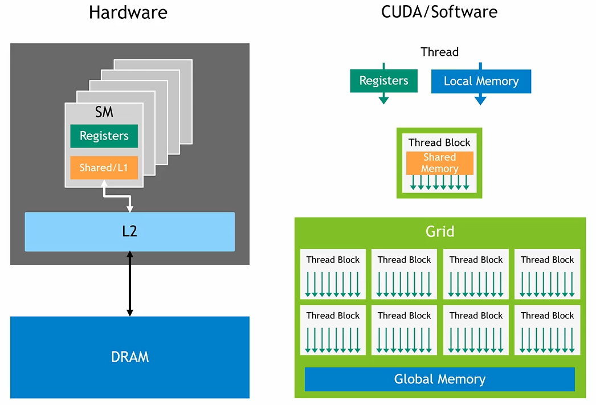
**Figure 1:** Software / hardware memory hierarchy of an Nvidia GPU. [source](https://www.Nvidia.com/en-us/on-demand/session/gtc24-s62191/). 

The GPU hardware is organized as follows:

- A GPU is made of an aggregation of Streaming Multiprocessors (SM) that contains the computational units. This is where the computations are done. Instructions are scheduled as so-called warps, i.e. instruction packs of size 32.
- The DRAM is the slowest but largest memory of the GPU. It's speed **is** the GPU bandwidth. It is accessible by all Streaming Multiprocessors (SM).
- The L2 cache is much smaller than the DRAM but faster. It is accessible by all SMs.
- There is one L1 cache per SM. It is much smaller than the L2 but faster and accessible by only his host SM.
- A register file per SM, much smaller than the L1 but the fastest memory, accessible by only his host SM.

The software is organized as follows:

- Threads are uniquely defined sequences of operations defined by the CUDA kernels. They are dispatched on the GPU's SM.
- Blocks of threads are groups of threads. Threads of a block may only reside on the same SM.
- Global memory is visible by all threads. It may reside in DRAM, L2 or L1 (potentially very slow!).
- Shared memory is visible by all threads of a block, and managed by the developer. Resides in L1.
- **Local memory** is private to a thread. It may reside in DRAM, L2 or L1 (potentially very slow!). Local memory includes both register spilling and stack usage. More on that in [section 2](#2-avoid-the-use-of-local-memory).
- Registers are private to a thread and reside in the SM's register file (the fastest!). 

## 1. Minimize redundant global memory accesses

On an Nvidia GPU, any request to global memory may end up fetching data from:

- The DRAM, visible by all threads,
- the L2 cache, visible by all threads,
- the L1 cache, visible by all threads of a block.

As discussed in [my blog post on the cost of communications](post2.md), on recent GPUs (V/A/H/B100) it takes 50-100x more time to load a non cached FP64 double from DRAM up to registers than computing a `FMA` (fused multiply-add) math operation on that number. The cache hierarchy does mitigates that number. If the L1 cache hits, the memory request will be much faster, with a FPL of "only" 5-10x. For the L2 cache, the factor is about 10-50x. But it remains that every access to global memory *is* more expensive than a register manipulation by a factor of at least 5-10x. Thus you should avoid them *at all cost*.

### 1. Minimize redundant thread-level global memory accesses

#### A first simple example, temporary register storage
Let's considers at [sample-1.cpp](https://github.com/rbourgeois33/rbourgeois33.github.io/blob/main/code-sample/sample-1.cpp) where we create two device views:
If you are not familiar with Kokkos views, in this context, they are just containers for vectors that resides on the GPU.
```c++
const int size = 1<<27;
Kokkos::View<float*> A("A", size);
Kokkos::View<float*> B("B", size);
```
We perform the following, rather silly kernel:
```c++
Kokkos::parallel_for("Kernel", size, KOKKOS_LAMBDA(const int i) { 
    for (int k=0; k<10; k++){
        A(i) += B(i-1);
        A(i) += B(i);
        A(i) += B(i+1);
    }
});
```
The issue is probably already striking to you: each instance of `A(i)+=` is a global memory R/W. The fix is straightforward and found in [sample-1-fixed.cpp](https://github.com/rbourgeois33/rbourgeois33.github.io/blob/main/code-sample/sample-1-fixed.cpp): use a temporary storage `tmp`, and R/W `A(i)`only once per thread:

```c++
Kokkos::parallel_for("Kernel", size, KOKKOS_LAMBDA(const int i) { 
    float tmp=0;
    for (int k=0; k<10; k++){
        tmp += B(i-1);
        tmp += B(i);
        tmp += B(i+1);
    }
    A(i) += tmp;
});
```
**Note**: Since each thread uses the same values of B as it's neighbors, shared memory could be used to further improve performance. However, this kernel is simple enough so that caches probably already do a good job.

With this simple change, we went from 60R, 30W per thread to 31R, 1W. You might think that it is such an obvious thing to avoid that it is not even worth talking about it. But I disagree! Often, when first porting to Kokkos, in a time limited environment, we simply replace the e.g. `std::vector` by `Kokkos::View` in the kernel body, check functionality and move onto the next kernel, resulting in this issue hindering performance. Moreover, for more very long, intricate kernels with many Views, spotting and   removing redundant memory accesses is quite tedious. Try for e.g. [this one](https://github.com/cea-trust-platform/trust-code/blob/509d09ae94bc5189131c6f160f1d42f6024cfa98/src/VEF/Operateurs/Op_Conv/Op_Conv_VEF_Face.cpp#L473).
#### Profiler diagnosis
Let's look into the profiler report for the first sample code (Download it and load it in `ncu-ui`! This works even if you do not have a Nvidia GPU), [sample-1.ncu-rep](https://github.com/rbourgeois33/rbourgeois33.github.io/blob/main/code-sample/sample-1.ncu-rep). First, let's look at the GPU Speed Of Light (SOL) section:
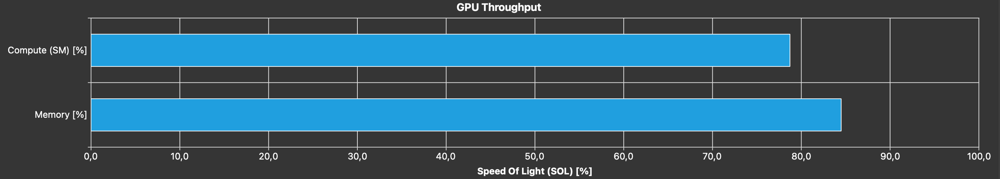
**Figure 2:** GPU SOL section of [sample-1.ncu-rep](https://github.com/rbourgeois33/rbourgeois33.github.io/blob/main/code-sample/sample-1.ncu-rep).

**Note:** According to the [`ncu` profiling guide](https://docs.nvidia.com/nsight-compute/ProfilingGuide/index.html); *SOL is a High-level overview of the throughput for compute and memory resources of the GPU. For each unit, the throughput reports the achieved percentage of utilization with respect to the theoretical maximum*. It's a fancy marketing term, yes, but quite a clever one if you ask me. Essentially, it tells you how much of the physical material's capacities you are using, and quicky tells you if you are limited by compute, or memory. Ideally, you know you are doing a good job of using your GPU when you are using at least 80% of at least one of the two pipeline, and that it is limited by either the DRAM bandwith, or the peak FLOPs capacity.

We can see that both the memory and compute pipelines are heavily used. This begs the question, are we using them effectively? Let's go to the memory workload analysis first and dissect some elements. 

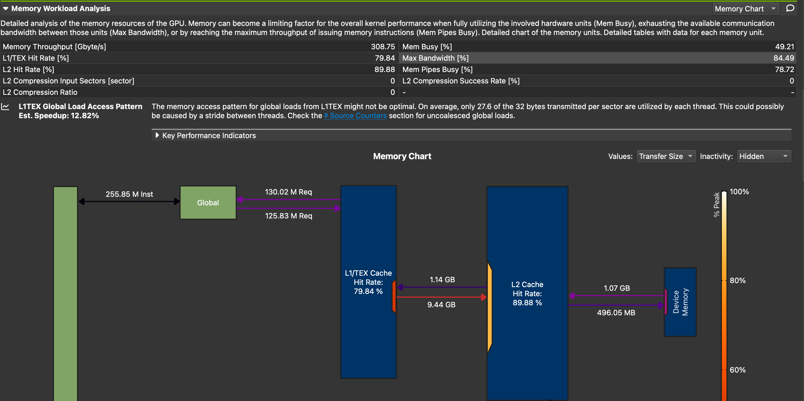
**Figure 3:** Memory workload analysis of [sample-1.ncu-rep](https://github.com/rbourgeois33/rbourgeois33.github.io/blob/main/code-sample/sample-1.ncu-rep).

- Memory Throughput [Gbyte/s] 308.75 
    - This is much lower than my GPU's bandwidth of 960.0. Since we saw in the SOL section that we are memory bound, this means that the performance limiter is the caches.
- Communications between DRAM (Device memory) and L2:
    - 1.07 GB reads, which corresponds to:
  $2^{27}(\text{size}) \times 2 (\text{A and B}) \times 4 (\text{bytes per float})=1.07\times 10^9$ bytes.
   There is half as much writes, corresponding to A being modified. Both A and B are loaded once into the L2 cache, and A is written back only once into DRAM Good!
- Communications between L2 and L1:
    - About as much reads into L1, a little more probably due to cache misses. But, an astounding 9.14 GB of data written from L1 to L2, due to cache invalidation! This  is a great hint of redundant memory accesses; a big discrepancy between expected and observed volumes of exchanges between memories. Essentially, this is the cache that is working hard to save you from you own mistakes, by not writing back all the way to DRAM at each `A(i)+=`. It really is saving you, as if we switch to throughput view, we see that these excessive writes are done at an astounding 1.89 TB/s, twice as fast as my GPU's bandwidth!
  
Lastly, let's look at one of my favorite sections, the warp state statistics session, especially the warp states:
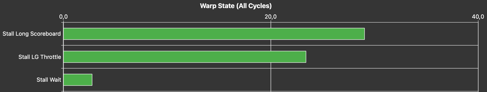
**Figure 4:** Warp States of [sample-1.ncu-rep](https://github.com/rbourgeois33/rbourgeois33.github.io/blob/main/code-sample/sample-1.ncu-rep).

If you are not familiar with warps states, really consider looking at [the 1h30 lecture by Athena Elfarou (Nvidia)](https://www.Nvidia.com/en-us/on-demand/session/gtc24-s62191/). Essentially, a warp is a group of 32 threads (32 instances of the kernel with neighboring index `i`). It can be either:

- Stalled: waiting on a dependency. For instance, to perform `A(i)+=B(i)`, you need to wait that both values get loaded from global memory into the registers. This takes a while. You can also be waiting on a math operation to be done, a barrier, or the execution queue to have a spot.
- Eligible: available to be scheduled.
- Selected: will issue an instruction on the next cycle.
  
The warp states shows you the **reasons** why your warps have been stalled during the execution of your kernel, sorted by importance. This is precisely what you should worry about! We see two reasons here with quite obscure names *Stall long scoreboard* and *Stall LG throttle*. You can drag over your mouse onto the items to get an explanation, e.g. for the first one:
.jpg)

**Figure 5:** Metric information for Stall long scoreboard.

Stall long scoreboard means that warps are waiting on a memory dependency from global memory, this not surprising and a very common one for memory bound kernels. *Stall LG throttle* means that the warps are waiting on the warp slot queue to have a spot to be scheduled. Indeed, each warp scheduler has a finite amount of spots for it's warps to be scheduled. If a kernel issues too many requests, warps are waiting, not on a dependency, but simply on a spot in the queue. This is also a good symptom of redundant memory operations! If you still observe that *Stall LG throttle* is limiting your performance even after removing all redundant memory operations, consider using [vectorized memory access](https://developer.Nvidia.com/blog/cuda-pro-tip-increase-performance-with-vectorized-memory-access/) to pull more floating point numbers per request.

Let's now look at the Compute workload analysis since Figure 2 shows us that the compute pipeline is heavily used. This can be surprising at first considering that our kernel is not compute intensive.

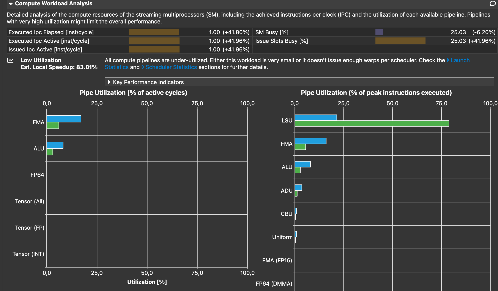
**Figure 6:** Compute workload analysis of [sample-1.ncu-rep](https://github.com/rbourgeois33/rbourgeois33.github.io/blob/main/code-sample/sample-1.ncu-rep).

As expected, the FMA pipe is strongly unutilized, and does not cause the heavy usage of the compute pipeline. Instead, the reason for this is that we almost reach the peak usage of the LSU pipe. If you drag your mouse to LSU, you will see that it refers to Load Store Unit. The LSU pipeline issues load, store, atomic, and reduction instructions to the L1TEX unit for global, local, and shared memory. Essentially, each time we load a value from global memory that resides in L1, the LSU pipe is used. We can expect that redundant thread-level global memory access hits in L1 most of the time. Therefore, this is yet another good symptom to look for.

Let's now take a look at [sample-1-fixed.ncu-rep](https://github.com/rbourgeois33/rbourgeois33.github.io/blob/main/code-sample/sample-1-fixed.ncu-rep). I recommend using the *"add baseline"* functionality, so that we can track our progress! First thing you can notice is that we get a huge performance gain: from 5.08ms to 1.81ms, a 64% speedup! Then, going into the several sections:

- GPU Speed of light throughput:
    - The compute pipeline is less busy, as the fixed kernel issues much less instructions to the `LSU` pipe.
    - The memory pipeline is more used (+6%)

- Memory workload Analysis: 
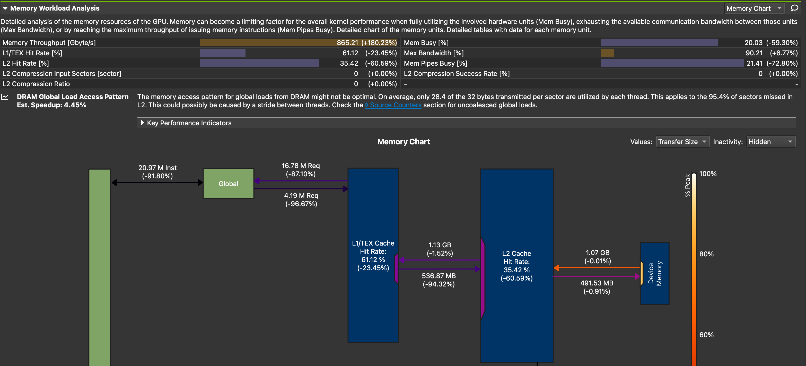
**Figure 7:** Memory workload analysis of [sample-1-fixed.ncu-rep](https://github.com/rbourgeois33/rbourgeois33.github.io/blob/main/code-sample/sample-1-fixed.ncu-rep).

    - The memory throughput is much closer to the theoretical peak (865 GB/s, +180%)
    - The previously healthy memory transfers are unchanged, but the L1 to L2 writes are reduced by 94%, as well as the caches hit rates. This shows that our cleaner implementation relies less on the caches, because it has much fewer redundant memory accesses.


<!-- We can see that the kernel uses both memory and compute pipelines extensively. The high value of memory usage is surprising; Each thread is performing a lot of math; around 30 `FMA`, but is is much lower than the FP32 FPL of the GPU I am working with (A [Nvidia RTX 6000 Ada generation](https://www.techpowerup.com/gpu-specs/rtx-6000-ada-generation.c3933), with a FP32 FPL of 379) -->
<!-- - 255.85M request between the kernel and global memory, split among ~130M Reads and ~130M Writes.
    - This corresponds to $2^{27}(30) -->
#### Static arrays as temporary storages
Let's now consider a multi-dimensional case, with 2D Views and at least one run-time axis size, here, `dim`:

```c++
const int size = 1<<27;
int dim = 3;
Kokkos::View<float**> A("A", size, dim);
Kokkos::View<float**> B("B", size, dim);
```

and the following kernel from [sample-2.cpp](https://github.com/rbourgeois33/rbourgeois33.github.io/blob/main/code-sample/sample-2.cpp):

```c++
Kokkos::parallel_for("Kernel", size, KOKKOS_LAMBDA(const int i) { 
    for (int k = 0; k < 10; k++){
        for (int dir = 0; dir < dim; dir++){
            for (int dir2 = 0; dir2 < dim; dir2++){
                A(i,dir) += B(i,dir2);
            }
        }
    }
});
```

It is clear that there are redundant memory accesses, that we would like to store in a array residing in registers as follows:

```c++
Kokkos::parallel_for("Kernel", size, KOKKOS_LAMBDA(const int i) { 
        
    float Atmp[dim], Btmp[dim];

    for (int dir = 0; dir < dim; dir++){
        Atmp[dir] = A(i, dir);
        Btmp[dir] = B(i, dir);
    }

    for (int k = 0; k < 10; k++){
        for (int dir = 0; dir < dim; dir++){
            for (int dir2 = 0; dir2 < dim; dir2++){
            Atmp[dir] += Btmp[dir2];
            }
        }
    }

    for (int dir = 0; dir < dim; dir++){
        A(i,dir) = Atmp[dir];
    }
});
```
 However, `dim` is a run-time variable, while arrays must be declared with compile time-value. In this case, this generate a compile error. If you somehow manage to get a run-time sized vector in your kernel and avoid a compilation error, you will at best get a slow runtime, as it will reside in local memory, cf. [section 2](#2-avoid-the-use-of-local-memory). The solution is to wrap the kernel in a `dim`-templated function, as done in [sample-2-fixed.cpp](https://github.com/rbourgeois33/rbourgeois33.github.io/blob/main/code-sample/sample-2-fixed.cpp):

```c++
template<int dim>
void apply_kernel(Kokkos::View<float**> A,  Kokkos::View<float**> B, int size){

    Kokkos::parallel_for("Kernel", size, KOKKOS_LAMBDA(const int i) { 
    // ... the previous kernel ...
    });
}
```

which can be called as follows, with `dim` picked at runtime:

```c++
if (dim==1){
    apply_kernel<1>(A, B, size);
} else if (dim==2){
    apply_kernel<2>(A, B, size);
} else if (dim==3){
    apply_kernel<3>(A, B, size);
} else{
   // Need more instantiations! Fail or warning 
}
```


I will not go through the `ncu` reports for this second example as the behavior is really similar to sample-1, but feel free to look a them yourself. The speedup obtained is 75% which is not surpising, since I pick the examples.

**Warning:** Note that when using static arrays as temporary storage, you might accidentally trigger *Local memory* usage as it may resides in the *stack* or cause *register spilling*. Please refer to [section 2](#2-avoid-the-use-of-local-memory) to avoid this!

### Minimize block-level redundant memory accesses: shared memory
If you spot that neighboring threads (that likely reside on the same block) are using extensively the same elements from global memory, I strongly suggest you learn more about shared memory, to reduce redundant **block-level** memory accesses. Shared memory is essentially a portion of the L1 cache managed by the user. But beware, using it means that you think you can do a better job than the runtime!). To use shared memory in Kokkos, look at [Hierarchical Parallelism](https://kokkos.org/kokkos-core-wiki/ProgrammingGuide/HierarchicalParallelism.html). As mentioned in the introduction, I do not wish to delve deeper on this topic in this tutorial.

### Minimize redundant kernel-level memory accesses: coalescing

#### Sectors and cache line
When using Nvidia GPUs, threads are packed in so-called warps of 32 threads which execute instructions simultaneously (SIMD). In the same way, when a memory request if performed, (like load one FP64 number from global memory), it is not done for a single one, but in packs of so-called *sectors* of 32 bytes (i.e. 4 FP64 numbers). Another way to say this is that the memory access granularity of the GPU is of 32 bytes. As a result, the best case scenario for a warp load, is that it requires data that is coalescing:

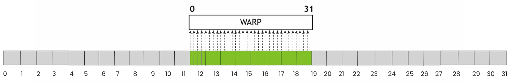
**Figure 8:** Coalesced memory accesses ([Source](https://www.Nvidia.com/en-us/on-demand/session/gtc24-s62191/)). 

In this ideal case, each thread is loading a FP64 number. There are 32 threads in a warps so this amount to 32 FP64 number, e.g. 256 bytes which is 8 sectors. This is very efficient because 256 bytes are loaded, and 256 bytes are used: the bandwidth of the GPU is fully used. Let's now look at the worst case scenario:

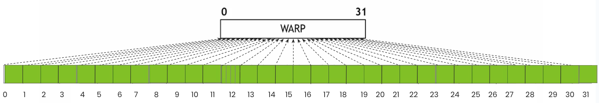
**Figure 9:** strided memory accesses. Adapted from [source](https://www.Nvidia.com/en-us/on-demand/session/gtc24-s62191/). 

In this case, each thread is still loading a FP64 numbers, but there is a sector-wide stride between threads. Since a FP64 number cannot be loaded "on it's own", a whole sector is loaded for each. As a result 32 sectors = 1024 bytes are loaded, for only 256 bytes used. This means that only a quarter of the bandwidth is used, and the case gets worst if you are working with smaller a datatype.

#### Profiler diagnosis

The ratio of bytes loaded to bytes used per memory request is actually shown in the memory workload analysis. For example, for [sample-1-fixed.ncu-rep](https://github.com/rbourgeois33/rbourgeois33.github.io/blob/main/code-sample/sample-1-fixed.ncu-rep):

**Figure 10:** DRAM global Load Access Pattern warning for `sample-1-fixed.cpp`.

We see that for each 32 bytes sector transmitted, "only" 28.4 are used. This is pretty good of course as this code is very simple. But for more complicated operations, such as numerical simulation on unstructured meshes, this can be very bad. This section of `ncu` is helpful to detect that precise issue and evaluate the efficiency of a solution.

The *"Source Counter"* section also detects uncoalesced global memory accesses, for instance in [compute-bound-kernel.ncu-rep](https://github.com/rbourgeois33/rbourgeois33.github.io/blob/main/code-sample/compute-bound-kernel.ncu-rep), we can read: *This kernel has uncoalesced global accesses resulting in a total of 434661683 excessive sectors (74% of the total 590018216 sectors).*


#### Advices
These observations should make you want to think about your data layout. In particular, **you should organize your data so that neighboring threads are working on neighboring data**. This means that there is not one universal answer on which storage is better for a dense matrix, row-major or column-major. If you are doing matrix-vector product, sure, row-major is better as it will be more cache friendly and coalescing. If you do matrix-transpose-vector product, you want column-major. In the same way, there is no universal answer to the debate Array of Structure vs. Structure of Array. It all depends on what you will be doing with your data, how you will iterate over it. In other words, **match your data layout with your iteration layout**. You will hear people say things like *"LayoutLeft (column-major) is best on GPU, LayoutRight (row-major) is best on CPU"*. This is **not** a general truth.<!--- It might be the case for specific codes that work on arrays of specific size, for instance `A[M][N]` with $M\gg N$ and a specific type of operations on it. But this cannot be taught as a generality  ---> Let's look at an example:

Consider a matrix `A` of size, `NxN` and the following two kernels:

1. compute `col`, a vector of `N` elements defined as the sum of each columns of `A`, by assigning each column to a thread,
2. compute `row`, a vector of `N` elements defined as the sum of each rows of `A`, by assigning each row to a thread.

**Note:** This is quite a bad way to parallelize this computation.

For kernel 1, storing `A` as column-major is better. Each thread is accessing a column which is a coalesced memory segment. If one uses row-major storage, we can expect terrible performance. The opposite argument applies for kernel 2. It will be fast for LayoutRight storage, and slow for LayoutLeft. In [sample-3.cpp](https://github.com/rbourgeois33/rbourgeois33.github.io/blob/main/code-sample/sample-3.cpp), we perform kernels 1 on both a LayoutLeft and a LayoutRight Kokkos View:

```c++
int N = 10000; 
Kokkos::View<float**, Kokkos::LayoutLeft>   A_LL("A_LL", N, N);      
Kokkos::View<float**, Kokkos::LayoutRight>  A_LR("A_LR", N, N);       
Kokkos::View<float*> row_sum("row_sum", N); 

// [...]

Kokkos::parallel_for("RowSumLL", N, KOKKOS_LAMBDA(int i) {
    float sum = 0.0;
    for (int j = 0; j < N; j++) {
        sum += A_LL(i,j);
        }
    row_sum(i) = sum;
});

Kokkos::parallel_for("RowSumLR", N, KOKKOS_LAMBDA(int i) {
    float sum = 0.0;
    for (int j = 0; j < N; j++) {
        sum += A_LR(i,j);
    }
    row_sum(i) = sum;
});
```
The report can be found at [sample-3.ncu-rep](https://github.com/rbourgeois33/rbourgeois33.github.io/blob/main/code-sample/sample-3-fixed) in which we can see that:

- `RowSumLR` runs in 0.52 ms,
- `RowSumLL` runs in 1.14ms (+120%). The memory workload analysis section says: *"On average, only 4.0 of the 32 bytes transmitted per sector are utilized by each thread"*. This is the worst case scenario with FP32 numbers, and it is caused by the huge stride between elements on the same line of `A_LL`. Moreover, the L1 cache is used a lot, whereas `RowSumLR` does not use it at all.

As you see, the best layout depends on what *operation* you plan on doing on your data, and *how* you plan on doing it i.e. which algorithm and which implementation. Another example is matrix multiplication where the best layout is cache/register-fitting blocked layout, *because* the best algorithm is cache/register-fitting blocked matrix multiplication. However, if you were to implement the naive version of matrix multiply `C=AB` where, for each element of `C`, you load a row of `A` and a column of `B` and perform the dot product, the best layout is storing `A/B` in row/column-major order respectively. For simulations on unstructured meshes, I recommend using [Z-order curve](https://en.wikipedia.org/wiki/Z-order_curve) re-ordering of the mesh-element. For our CFD code TRUST, this enabled an overall +20% speedup due to a better coalescing (congrats to [Adrien Bruneton](https://www.linkedin.com/in/adrien-bruneton-7bb0ba94/).

**Note:** A non-coalesced write of some data that is later re-loaded by the same thread is especially bad for performance, as it needs to invalidate caches. A single non-coalesced write can invalidate a sector in L1, and L2, requiring the data to be fetched potentially all the way from DRAM for the next load.

**Note:** The default layout for multidimensional views in Kokkos is LayoutLeft on device, and LayoutRight on host. I believe this is due to historical reasons; Algorithms from the Trilinos library that is built upon Kokkos runs more efficiently this way. But again, this is application-specific.

## 2. Avoid the use of local memory
### What is local memory, how to detect it's usage.
As we saw in the introduction's refresher, local memory is private to a thread and may reside in DRAM, L2 or L1, which is potentially very slow, and in any case much slower than registers. Local memory usage happens in two cases:

- when the *"stack"* is used,
- when *"register spilling"* happens.

We will try to understand both and remove them from our kernels. One good thing about both of these is that the decision of using them is made at *compile-time* by `nvcc`. As a result, using the right compile flag (`-Xptas -v`), one can detect it easily, without having to run / profile the code. The flags are used in the sample code's [CMakeLists.txt](https://github.com/rbourgeois33/rbourgeois33.github.io/blob/main/code-sample/CMakeLists.txt), and each kernel compilation produces such an output:
```
ptxas info    : Compiling entry function '[verbose Kokkos mangled name]' for 'sm_89'
ptxas info    : Function properties for [verbose Kokkos mangled name]
    24 bytes stack frame, 0 bytes spill stores, 0 bytes spill loads
ptxas info    : Used 28 registers, used 0 barriers, 24 bytes cumulative stack size, 
                    512 bytes cmem[0]
ptxas info    : Compile time = 5.300 ms
```

if `bytes stack frame` is greater than 0, you are using the stack. If either `bytes spill stores` or `bytes spill loads`are greater than 0, register spilling is happening.

**Note:** As far as I know there is not such a flag for AMD GPUs. You can however dump the `asm` and look for your kernel and the corresponding information. This is possible, just less straightforward.

### Avoid stack usage
#### Precautions when using static arrays for temporary storage
Stack usage arises when using static arrays for temporary storage to reduce redundant thread-level global memory accesses. In particular, this happens when the array is accessed with a runtime variable, that the compiler cannot resolve at compile time. Because the compiler cannot predict the access pattern, it places the array in local memory, which provides the necessary flexibility for dynamic indexing despite terrible performances. Let's look at a mock example:

```c++
// Within a GPU kernel, thread id is i
double tmp[3]
tmp[2] = ... //OK! resolvable at compile time
int index = view_with_indexes_in_it(i) 
tmp[index] = .. //Not OK! Compiler cannot resolve this. It cannot compute the value of index. 
//tmp has to reside in local memory from the start
```
The fix is quite disappointing in my opinion, but necessary. If you are sure that values from `view_with_indexes_in_it(i)` are in $[0,2]$, then, you can apply a switch, i.e. replace the last line by:
```c++
switch(index){
    case 0:
        tmp[0]=...; break;
    case 1:
        tmp[1]=...; break;    
    case 2:
        tmp[2]=...; break; 
    default:
        //Error 
}
```
This can also happens when static arrays are used in loops that cannot be unrolled, see [sample-5.cpp](https://github.com/rbourgeois33/rbourgeois33.github.io/blob/main/code-sample/sample-5.cpp):
```c++
    int bound=3;
    Kokkos::parallel_for("Kernel", size, KOKKOS_LAMBDA(const int i) { 
        float tmp[3];  
        // some stuff
        for (int k=0; k<bound; k++){ 
          tmp[k] += A(i+k);
        }
       // some stuff
    });
```
in this piece of code, `bound` is a non-const, runtime variable that `nvcc` cannot deduce when compiling the kernel. Therefore, `tmp` is not statically addressed and has to reside in local memory. Try compiling  as it is, and after adding a `const` clause in `bound`'s declaration, and observe the difference in the output pf `Xptas`.

#### Profiler diagnosis
Let's look at a [sample-4.cpp](https://github.com/rbourgeois33/rbourgeois33.github.io/blob/main/code-sample/sample-4.cpp) that resembles sample-2, but with an indirection table that is filled such that it contains values in $[0, \text{dim}[$:

```c++
Kokkos::View<int**> indirections("indirections", size, dim);
Kokkos::parallel_for("fill indirections", size, KOKKOS_LAMBDA(const int i) { 
    for (int dir = 0; dir < dim; dir++){
        indirections(i, dir) = (dir+1)%dim; 
    }
});
```
Then, the table is used in the kernel:
```c++
template<int dim>
void apply_kernel(Kokkos::View<float**> A,  Kokkos::View<float**> B, Kokkos::View<int**> indirections, int size){
Kokkos::parallel_for("Kernel", size, KOKKOS_LAMBDA(const int i) { 
        
        float Atmp[dim], Btmp[dim];
        int indir[dim];

        for (int dir = 0; dir < dim; dir++){
            indir[dir] = indirections(i, dir); //Here we store the indirections
           // ... same as sample-2
        }
        for (int k = 0; k < 10; k++){
            for (int dir = 0; dir < dim; dir++){
                for (int dir2 = 0; dir2 < dim; dir2++){
                    Atmp[indir[dir]] += Btmp[dir2]; //Not OK! Compiler cannot resolve this. 
                    // It cannot predict the value of indir[dir]. 
                    // tmp now resides in local memory
                }
            }
        } 
        // ... same as sample-2
    });
}
```
The compilation produces the following compiler output:
```
ptxas info    : Compiling entry function '[verbose Kokkos mangled name]' for 'sm_89'
ptxas info    : Function properties for [verbose Kokkos mangled name]
    16 bytes stack frame, 0 bytes spill stores, 0 bytes spill loads
ptxas info    : Used 28 registers, used 0 barriers, 16 bytes cumulative stack size, 
                    512 bytes cmem[0]
ptxas info    : Compile time = 103.683 ms
```
To fix this, we use a switch in [sample-4-fixed.cpp](https://github.com/rbourgeois33/rbourgeois33.github.io/blob/main/code-sample/sample-4-fixed.cpp):
```c++
switch (indir[dir]){
    case 0:
        Atmp[0] += Btmp[dir2];
        break;
    case 1:
        Atmp[1] += Btmp[dir2];
        break;
    case 2:
        Atmp[2] += Btmp[dir2];
        break;
}
```
which solves the issue, as seen in the logs:
```
    0 bytes stack frame, 0 bytes spill stores, 0 bytes spill loads
ptxas info    : Used 24 registers, used 0 barriers, 512 bytes cmem[0]
```
Now, comparing the `ncu` reports [sample-4.ncu-rep](https://github.com/rbourgeois33/rbourgeois33.github.io/blob/main/code-sample/sample-4.ncu-rep), [sample-4-fixed.ncu-rep](https://github.com/rbourgeois33/rbourgeois33.github.io/blob/main/code-sample/sample-4-fixed.ncu-rep) we can see that:

- The fixed version is 32% faster (6.98ms vs 10.37 ms).
- Both compute and memory pipelines are used much more effectively in the fixed version (see SOL section).
- The warps are much less stalled for *"Stall Long Scoreboard"* i.e. on local memory dependency in this case.
- The memory workload analysis allows to track local memory usage. For the fixed version, it's 0, -100%!
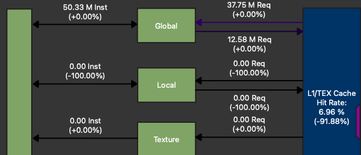

**Figure 11:** Memory workload analysis for sample-4-fixed.ncu-rep, with sample-4.ncu-rep as a baseline. Zoom on Kernel <-> L1 interactions.

- We also see that the L1 cache is much less used (-92%) in the fixed version, because local memory resides in the L1 cache.
- Lastly, the source view allows to track the line(s) responsible for local memory usage:
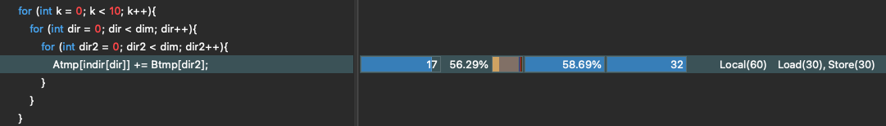  
**Figure 12:** Local memory usage localization in `ncu`'s source view for [sample-4.ncu-rep](https://github.com/rbourgeois33/rbourgeois33.github.io/blob/main/code-sample/sample-4.ncu-rep).

As you can see, there are many ways to detect stack usage, at compile time with the right flags, or in `ncu`. This is also the case for register spilling, as detailed in the next section.

### Avoid register spilling
Register spilling happens when threads are requiring too much registers, so much so that it would hinders *occupancy* in such an extreme way that the compiler decides to "spill" the memory that should initially be in registers, into slow local memory. Therefore, advice on improving occupancy by reducing per-thread register usage will help avoiding register spilling. As a result, we refer to the the "[How to reduce per-thread register usage](#how-to-reduce-per-thread-register-usage)" section as the advice will coincides. You can also play with [launch_bounds](https://docs.Nvidia.com/cuda/cuda-c-programming-guide/index.html?highlight=launch%2520bounds#launch-bounds) to avoid register spilling, at the cost of occupancy, but his is beyond the scope of this tutorial.

**Note:** If register spilling was always bad, CUDA would not allow it. It might be useful sometimes but in my limited experience I could always get rid of it and get good performances.

#### Profiler diagnosis
Register spilling is detected the exact same way than stack usage. It can be detected at compile time, it appears as local memory transactions in the memory workload analysis and shows up in the source view too.

## 3. Understand and improve occupancy

### Refresher on occupancy

#### What is occupancy
Let's start by a short refresher on occupancy. But for the n-th time, consider looking at [the 1h30 lecture by Athena Elfarou (Nvidia)](https://www.Nvidia.com/en-us/on-demand/session/gtc24-s62191/). As we saw in the introduction's [refresher](#refresher-software-hardware-concepts-in-cuda), threads reside on the GPU's SMs as warps of 32. Each SM can host a maximum given number of active warps, e.g. 48 for my [Nvidia RTX 6000 Ada generation](https://www.techpowerup.com/gpu-specs/rtx-6000-ada-generation.c3933) GPU. This maximum hardware value depends on the so-called compute capability of the GPU, e.g. the SM's version. The occupancy of a kernel is the average measured ratio of active warps per SM to the maximum hardware value. Discrepancies between the two happen because each SM only has a limited amount of:

- registers that it can share among threads,
- shared memory (hardware L1 cache) that it can share among threads,
- numbers of threads and blocks it can host.

As a result, in order to improve occupancy, you may consider:

- reducing per-thread register usage,
- reduce shared memory usage,
- tuning your launch configuration.
  
I will only cover the first item in depth, as my experience with [launch_bounds](https://docs.Nvidia.com/cuda/cuda-c-programming-guide/index.html?highlight=launch%2520bounds#launch-bounds) is limited, and I decided not to talk too much about shared memory in this blog. I still briefly mention it in the "[Do not use `Kokkos::MDRangePolicy`](#kokkos-specific-do-not-use-kokkosmdrangepolicy)" section.

#### Why improving occupancy: latency hiding

The reason why high occupancy is important is that is enables *"latency hiding"*. As explained in [Bob Crovella's 3rd lecture](https://www.youtube.com/watch?v=cXpTDKjjKZE&list=PL6RdenZrxrw-zNX7uuGppWETdxt_JxdMj&index=3), having multiple active warps allows to not waste clock cycles:
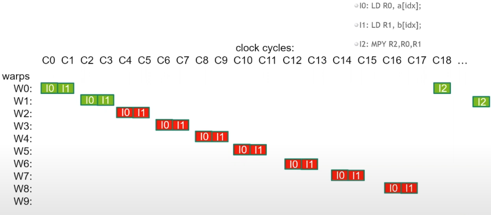

**Figure 13** Latency hiding, source: [Bob Crovella's 3rd lecture](https://www.youtube.com/watch?v=cXpTDKjjKZE&list=PL6RdenZrxrw-zNX7uuGppWETdxt_JxdMj&index=3).

In this picture, we zoom into an SM for the execution of three instructions:

- `I0`: Loading `a[idx]` into register `R0`.
- `I1`: Loading `b[idx]` into register `R1`.
- `I2`: Computing `R0*R1` and storing the result into `R2`.

**Note:** The same logic is going on on all other SM's, and that registers `R0/1/2` correspond to different addresses on the SM's register file for each thread.

It is clear that `I0` and `I1` are independent i.e. `I1` can be scheduled without having to wait for `I0` to be finished. This enables what is called *Instruction Level Parallelism (ILP)*. Indeed, on clock cycle `C0`, `W0` issues `I0`. Then, while `I0` has started, on clock cycle `C1`, `W0` issues `I1`. Already some latency hiding is happening at the warp level; during `C1`, `I1` was issued while `I0` has made one clock cycle worth of progress. 

Then, `W0` cannot issue `I2` since this instructions depends on the result of the two previous instructions. They take 18 clock cycles to finish, and at clock cycle `C18`, `I2`is issued. This is quite a lot of latency. But at clock cycle `C2`, the *warp scheduler* moved onto the next warp `W1` to issue `W1`'s`I0` and `I1`. Effectively, `W0`'s latency is hidden by the other warps, and this continues down to warp 8 so that no clock cycles are lost and each correspond to an issued instruction. Therefore, the more active warps you can fit in your SM, the longest latency you can hide.

#### When to stop: just make sure your hardware is used

In general, more occupancy is better and you should try to maximize it. But do not fall in the *occupancy trap*. Sometime, kernels run better at low occupancy; applying advice 1 i.e. using register storage to avoid thread-level redundant memory accesses might impact negatively occupancy but often improve performance. Same story for shared memory usage. Lastly, having a high ILP often implies using more registers as results of the instructions must coexists in allocated registers. But this might not be an issue as latency is hidden anyway. Imagine Figure 13 with:

- `I0` an instruction that takes 18 cycles to complete (finishes at `C18`) followed by
- `I1-I17`, 17 instructions that take each one cycle to complete (finishes at `C2-C18`), and,
- the last instruction `I18`, issued at `C18` requiring the result of all of them.
  
The SM would issue an instruction per clock cycle, not one cycle would be wasted and only one warp would suffice. That means you can get good hardware usage even at low occupancy. More so than occupancy, this should be your metric: **Tune occupancy to maximize your hardware's usage**. The best occupancy is the one that leads to the biggest global memory throughput / best achieved Flops. So, open up `ncu`, refer to the SOL section, and experiment!

### Profiler diagnosis
Let's look at  [sample-7.ncu-rep](https://github.com/rbourgeois33/rbourgeois33.github.io/blob/main/code-sample/sample-7.ncu-rep) that shows an horrendous occupancy (we will understand why and how to fix it later). The issue is striking in the SOL section:
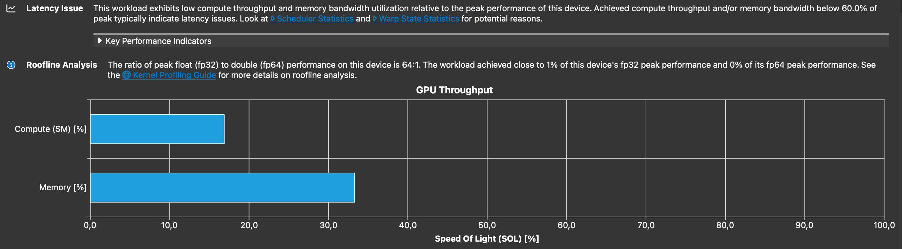

**Figure 14** SOL section of [sample-7.ncu-rep](https://github.com/rbourgeois33/rbourgeois33.github.io/blob/main/code-sample/sample-7.ncu-rep).

Even though the there are a lot of threads, the hardware is barely used, and it is even hinted that there is an issue with latency. The warp state statistics says that we are mostly waiting on long scoreboard dependency. The occupancy section is clear:
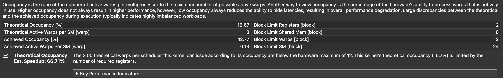

**Figure 15:** Occupancy section of [sample-7.ncu-rep](https://github.com/rbourgeois33/rbourgeois33.github.io/blob/main/code-sample/sample-7.ncu-rep).

The achieved occupancy is only of 12%! This is extremely low, and `ncu` predicts that we could get a 66% speedup by improving it. We will see that this prediction is accurate in the "[Template away heavy branches](#template-away-heavy-branches)" section. It also indicates that the limiting factor is the register usage. Indeed, let's look at the occupancy graphs:

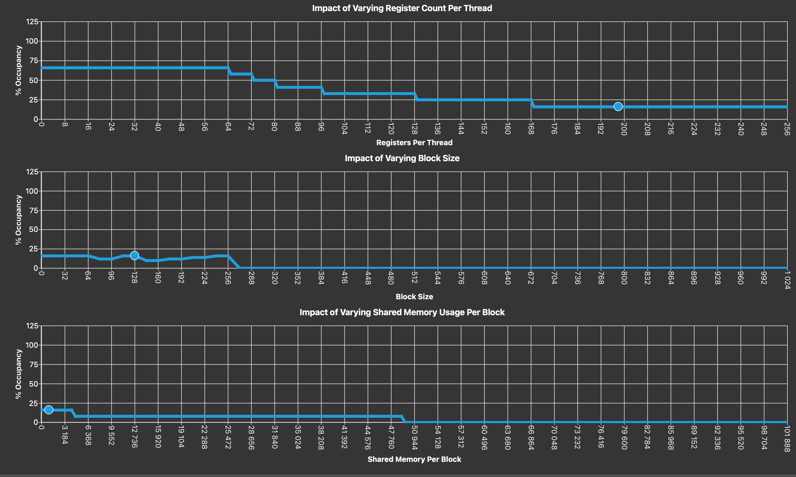
**Figure 16:** Occupancy graphs of [sample-7.ncu-rep](https://github.com/rbourgeois33/rbourgeois33.github.io/blob/main/code-sample/sample-7.ncu-rep).

They provide a very accurate prediction of how would the occupancy of your kernel vary if you managed to change: -the register count per threads -the block size -the shared memory usage. The current state of the kernel is represented as dots on the line graphs. Note that these graphs are not the result of the kernel being instrumented, but solely from an occupancy calculation that can be done at compile time.
We can see that we can barely improve the occupancy by changing the block size / shared memory usage, but if we are able to move the register usage to the left, we can expect significant progress. Now, let's see how to do this.

### How to reduce per-thread register usage
#### Re-order operations?
In my limited experience, I have found no success in re-ordering operations within a kernel to optimize occupancy. In all the case that I saw, I was unable to be smarter than `nvcc` in my reordering. When you “manually” reorder source-level operations, most of the time `nvcc` will just re-schedule them back to an equivalent order it thinks is best. That’s why you usually don’t see improvements. My guess is that the compiler builds some sort of [direct acyclic graph](https://en.wikipedia.org/wiki/Directed_acyclic_graph) from the instruction dependency, and solves a balance between ILP and register usage. But I might be very wrong! Instead, to get real gains the only options is to really change the operations you are doing.

#### [Kokkos specific] Do not use `Kokkos::MDRangePolicy`

**Important Note:** The issues of `Kokkos::MDRangePolicy` mentionned in this section have been noticed by [the CExA project](https://cexa-project.org/) team and are currently being fixed. I look forward to removing this section.

I really love Kokkos, so I hate to write this but, as of now (September 2025), `Kokkos::MDRangePolicy` has a few issues that obliges me to advise you not to use it, namely:

- excessive register usage, probably due to the internal tiling algorithm,
- very questionable default block size choice.

If these get eventually solved, or if an alternative is proposed, I will happily change this part of my blog. Let's look at [sample-6.cpp](https://github.com/rbourgeois33/rbourgeois33.github.io/blob/main/code-sample/sample-6.cpp) that applies a blurring kernel to a 2D view:

```c++
// ...
Kokkos::View<float**> A("A", size, size);
Kokkos::View<float**> B("B", size, size);
// ...
auto policy =  Kokkos::MDRangePolicy<Kokkos::Rank<2>> ({1,1}, {size-1, size-1});
Kokkos::parallel_for("blurr", policy, KOKKOS_LAMBDA(const int i, const int j) { 
      
      float tmp=0;
      
      tmp += B(i-1,j);
      tmp += B(i,j);
      tmp += B(i+1,j);
      tmp += B(i  ,j+1);
      tmp += B(i  ,j-1);

      A(i,j)=tmp*fifth;
});
```
When compiling it, we see `ptxas info    : Used 30 registers, used 0 barriers, 544 bytes cmem[0]`. For [sample-6-fixed.cpp](https://github.com/rbourgeois33/rbourgeois33.github.io/blob/main/code-sample/sample-6-fixed.cpp) where I linearized the 2D index:

```c++
Kokkos::parallel_for("blurr", (size-2)*(size-2), KOKKOS_LAMBDA(const int ilin) { 
      
      const int i = 1 + (ilin % (size-2));
      const int j = 1 + (ilin / (size-2));

      float tmp=0;
      
      tmp += B(i-1,j);
      tmp += B(i,j);
      tmp += B(i+1,j);
      tmp += B(i  ,j+1);
      tmp += B(i  ,j-1);

      A(i,j)=tmp*fifth;

});
```
we see `ptxas info    : Used 22 registers, used 0 barriers, 488 bytes cmem[0]`. This means that the `MDRangePolicy` uses 8 extra registers. Moreover, when looking at [sample-6.ncu-rep](https://github.com/rbourgeois33/rbourgeois33.github.io/blob/main/code-sample/sample-6.ncu-rep), we see that the base version lasts 36ms vs 9.86ms for [sample-6-fixed.ncu-rep](https://github.com/rbourgeois33/rbourgeois33.github.io/blob/main/code-sample/sample-6-fixed.ncu-rep). This huge gain is not due to the 8 saved registers (that would be too much). Instead, let's look at the occupancy graph of [sample-6-fixed.ncu-rep](https://github.com/rbourgeois33/rbourgeois33.github.io/blob/main/code-sample/sample-6-fixed.ncu-rep):

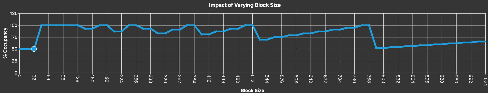

**Figure 17:** Occupancy graphs of [sample-6-fixed.ncu-rep](https://github.com/rbourgeois33/rbourgeois33.github.io/blob/main/code-sample/sample-6-fixed.ncu-rep)

The block size picked by the `Kokkos::MDRangePolicy` is 32, which is a very bad choice and leads to an occupancy of 50%. This explains the performance gain of the fixed version that show a 100% occupancy. I did not wish to go deeper on launch configuration optimization, but if you spot an issue like this in your profiler, go ahead and change the block size!

**Note:** The choice of the block size can be tuned in Kokkos, I was simply pointing out that the default choice can be bad. However, I do not think there is a way to fix the extra register usage.

#### Template away heavy branches
Now, let's look at [sample-7.cpp](https://github.com/rbourgeois33/rbourgeois33.github.io/blob/main/code-sample/sample-7.cpp) where we added a runtime variable determining if we want to perform an heavy operation in the kernel:

```c++
bool expensive_option = false;
```

and the kernel:
```c++
Kokkos::parallel_for("blurr", (size-2)*(size-2), KOKKOS_LAMBDA(const int ilin) { 
      
      const int i = 1 + (ilin % (size-2));
      const int j = 1 + (ilin / (size-2));

      float tmp = 0.0f;

      tmp += B(i-1,j);
      tmp += B(i,j);
      tmp += B(i+1,j);
      tmp += B(i  ,j+1);
      tmp += B(i  ,j-1);
      tmp *= fifth;

      if (expensive_option) {
        expensive_function(B, tmp, i, j);
      }

      A(i,j) = tmp;
});
```

I do not want to detail `expensive_function` here, but it is an AI-generated inline function that allocates and use a 128 elements array of floats, costing a huge amount of registers. In fact, when compiling the code, we get `ptxas info    : Used 198 registers, used 0 barriers, 480 bytes cmem[0]`, for an option that is not even used. Just like for sizing the temporary storage of section 1, the solution found in [sample-7-fixed.cpp](https://github.com/rbourgeois33/rbourgeois33.github.io/blob/main/code-sample/sample-7-fixed.cpp) is to use templates:

```c++
template <bool expensive_option>
void blurredKernel(Kokkos::View<float**> A, Kokkos::View<float**> B, const int size){
      
      Kokkos::parallel_for("blurr", (size-2)*(size-2), KOKKOS_LAMBDA(const int ilin) { 
      
        const int i = 1 + (ilin % (size-2));
        const int j = 1 + (ilin / (size-2));

        float tmp = 0.0f;

        tmp += B(i-1,j);
        tmp += B(i,j);
        tmp += B(i+1,j);
        tmp += B(i  ,j+1);
        tmp += B(i  ,j-1);
        tmp *= fifth;

        if constexpr(expensive_option) {
          expensive_function(B, tmp, i, j);
        }

        A(i,j) = tmp;
    });
```
The `if constexpr` clause allows to compile the `expensive_option=true/false` versions of the kernel separately, one with heavy register usage, one with light register usage. We write a switch in the main function:
```c++
bool expensive_option = false;

if (expensive_option){
  blurredKernel<true>(A, B, size);
}else{
  blurredKernel<false>(A, B, size);
}
```
This reduces the register usage to 24 (again, this is huge because I pick the example, but the goal is to show you the principles). The achieved occupancy is bumped from 12% to 77%, reducing the runtime from 26.77 to 9.74ms (-63%), basically what `ncu` predicted is the "[Profiler Diagnosis](#profiler-diagnosis_4)" section.


## 4. Avoid basic compute mistakes

As mentioned in the introduction, most of the kernels I work with in the context of my CFD code are heavily memory bound. Therefore, this section is much slimmer and not exhaustive at all. However, as mentioned before, I do my performance tests on a [Nvidia RTX 6000 Ada generation](https://www.techpowerup.com/gpu-specs/rtx-6000-ada-generation.c3933) GPU which has a very limited amount of FP64 CUDA cores (1:64 compared to FP32). As a result, even with a very memory bound kernel, I can quickly reach the compute limits of my GPU. This led me to figure out a short lists of things to keep in mind when writing math in a GPU kernel

### Profiler diagnosis
For this section, I provide a [`ncu` report](https://github.com/rbourgeois33/rbourgeois33.github.io/blob/main/code-sample/compute-bound-kernel.ncu-rep) for a compute bound kernel from TRUST. Let's open it up and look at the relevant sections, starting with SOL:
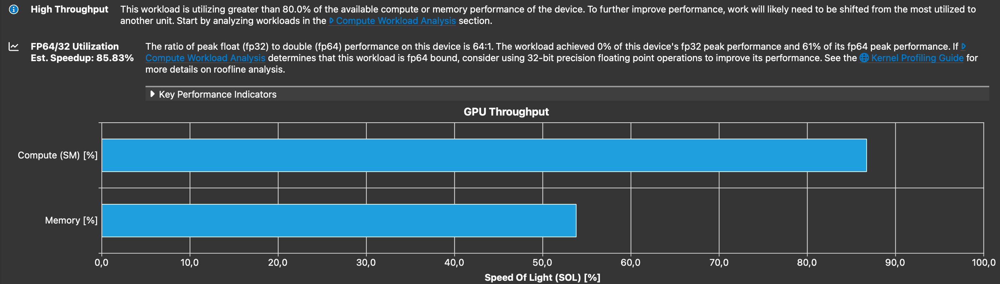
**Figure 18:** GPU SOL section of [compute-bound-kernel.ncu-rep](https://github.com/rbourgeois33/rbourgeois33.github.io/blob/main/code-sample/compute-bound-kernel.ncu-rep).

We can see that the kernel is mostly compute bound, and the profiler mentions: *The ratio of peak float (fp32) to double (fp64) performance on this device is 64:1. The workload achieved 0% of this device's fp32 peak performance and 61% of its fp64 peak performance. If Compute Workload Analysis determines that this workload is fp64 bound, consider using 32-bit precision floating point operations to improve its performance.* <!---The latter point was explored by our intern [Dyhia Elhaddad](https://www.linkedin.com/in/dyhia-elhaddad-912318233/), leading to a X% (WIP) speedup. Refer to [my blog post on verrou (WIP)](post3.md) for more details.---> In this blog post, I will not talk about the use of reduced precision. Let's look at the compute section of the `ncu` report:

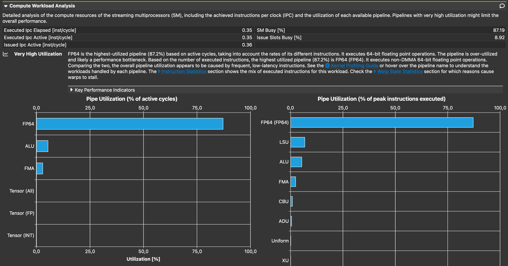
**Figure 19:** Compute workload analysis section of [compute-bound-kernel.ncu-rep](https://github.com/rbourgeois33/rbourgeois33.github.io/blob/main/code-sample/compute-bound-kernel.ncu-rep).

Unsurprisingly, we can see that the most used pipeline is `FP64`(FP64 `FMA`), followed by `ALU`(bool manipulations, int32 operations except ADD and MUL), `FMA` (FP32 and int32 `ADD` and `MUL`) and `LSU` (Load/store operations to L1). The graph on the left shows the percentage of cycle during which the different pipeline were active, while the graph on right shows the achieved % of peak instructions executed. 

By itself, this section does not really tell that the compute is the bottleneck, only that the compute pipelines are very active. As suggested, we can look into the warp state statistics sections to identify the bottlenecks:

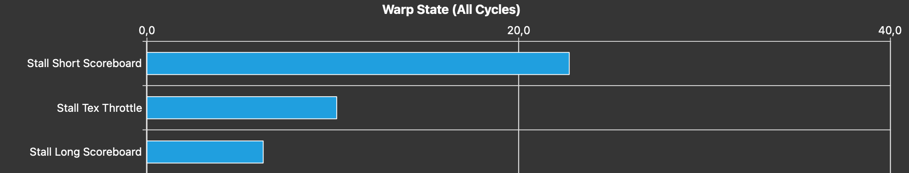
**Figure 20:** Warp State Statistics section of [compute-bound-kernel.ncu-rep](https://github.com/rbourgeois33/rbourgeois33.github.io/blob/main/code-sample/compute-bound-kernel.ncu-rep).

The main stall reason we observe is *“Stall Short Scoreboard”*. The metric description is somewhat unclear to me, but based on this [Stack Overflow post](https://stackoverflow.com/questions/66123750/what-are-the-long-and-short-scoreboards-w-r-t-mio-l1tex), it includes stalls caused by dependencies on FP64 on GPUs that have a very small amount of FP64 CUDA cores compared to FP32. This is the case for my GPU. The culprit, therefore, is the FP64 operations. If the bottleneck were instead dependencies on FP32 operations, or on FP64 operations running on a “compute” GPU (e.g. one with an FP32-to-FP64 ratio of 1:2 such as the A100), then the primary stall reason would appear as “Stall Wait”. 

If applicable, you should consider using [tensor cores operations](https://developer.Nvidia.com/blog/optimizing-gpu-performance-tensor-cores/) that have a much larger throughput than standart FMA pipes. Now, let's look at a few basic, easy to avoid compute mistakes.
### A few basic compute mistakes
- Use `FMA` instead of `+, *`:
    - a FP32/FP64 `FMA` is the same cost as a single addition or a single multiplication. So try to fuse them! Note: You can tell `nvcc` to do the fusing for you using the compile option `--fmad`. **Warning** This may lead to different results in floating point arithmetics: doing a `+` followed by a `*` is not bitwise equivalent to a `FMA`.
- Avoid `/`:
    - Divisions are expensive, and probably rely on some kind of iterative process, requiring several `FMA`'s. Try refactoring your math to minimize them, and if you spot that your kernel involves several divisions by the same number, compute the inverse once `double inverse = 1.0/number`, and multiply by `inverse` instead.
- Do not accidentally use doubles:
    - If you work with FP32 numbers, be careful when using hard coded floating point numbers. `0.0`, `3.0`are FP64 number. If you do operations on them, it will involve the FP64 pipelines. Instead, use e.g. `0.0f`.
- Int math can be a bottleneck:
    - If your kernel involves a lot of not unrolled loop, the integer pipeline can be heavily utilized and become a bottleneck. We typically do not think about this as we only talk about the FP32 and FP64 throughput, but it can happen. To spot this, look for:
        - a lot of `FMA` in the compute workload analysis section,  
        - a lot of `IMAD` in the instruction statistics section,
        - a lot of *"Stall Wait"* in the warp state statistics section.
  
## 5. Avoid intra-warp thread divergence
As mentioned earlier, threads in Nvidia GPUs are packed into so-called *warps* of size 32 (64 for AMD GPUs !). The GPU is only able to issue warp-wide instructions. It is still possible to obtain single-thread granularity of instructions, but at a performance cost. Let's look at figure 21:

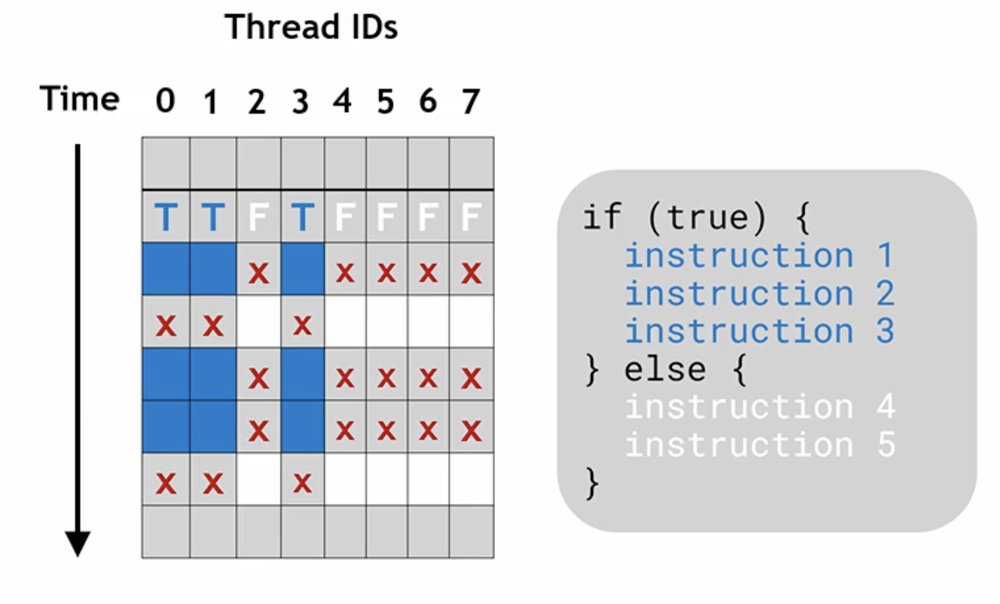
**Figure 21:** Representation of intra-warp thread divergence, source: [the 1h30 lecture by Athena Elfarou (Nvidia)](https://www.Nvidia.com/en-us/on-demand/session/gtc24-s62191/).

A fictional 8-threads warp is represented and executes a mock piece of code which has two logical branches: blue and white. Threads 0, 1 and 3 want to execute the blue instructions, threads 2,4,5,6,7 want to execute the white instructions. Since the GPU can only issue warp-wide instructions, granularity is recovered by *"de-activating"* threads during cycles. For example, during the first represented cycle, threads 0,1,3 issue instruction 1 while the others are de-activated (they probably issue instruction 1 too since instructions are warp-level, but throw away the result). During the 2nd cycle, threads 0,1,3 are de-activated while the other issue instruction 4. This way, granularity is recovered but at the cost of extra clock cycles. Indeed, each thread has to wait on all instructions to be complete, including the ones of the execution path that it is not taking.

As a result, you only have one thing to keep in mind to avoid this issue: **Avoid intra-warp thread divergence**. You don't have to worry about block-level thread divergence or anything else.

### Profiler diagnosis
Let's look at [sample-8.cpp](https://github.com/rbourgeois33/rbourgeois33.github.io/blob/main/code-sample/sample-8.cpp) where I perform a funky meaningless reduction into `reduce`:

```c++
Kokkos::parallel_reduce("Kernel", size, KOKKOS_LAMBDA(const int i, float& lsum) { 
      
    float x = ((float) i)*dx;

    if ( i%32 < 16 ){
        lsum += x;
    }else{
        lsum += Kokkos::cosh(x);
        lsum -= Kokkos::sinh(x);
    }

}, result);
```
I force the thread divergence with the condition `if ( i%32 < 16 )`. The first half of each warp will perform the simple sum, while the second half will perform `cosh` and `sinh` evaluations. Let's open up [sample-8.ncu-rep](https://github.com/rbourgeois33/rbourgeois33.github.io/blob/main/code-sample/sample-8.ncu-rep) and jump right into the warp state statistics section. It shows the following explicit warning:

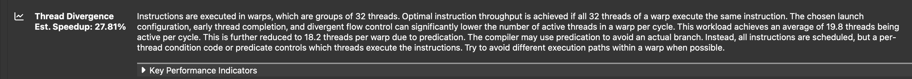
**Figure 22:** Thread divergence warning in the Warp State Statistics section of [sample-8.ncu-rep](https://github.com/rbourgeois33/rbourgeois33.github.io/blob/main/code-sample/sample-8.ncu-rep).

In [sample-8-fixed.cpp](https://github.com/rbourgeois33/rbourgeois33.github.io/blob/main/code-sample/sample-8-fixed.cpp), I removed the thread divergence by replacing the condition by `if ( i%64 < 32 )`. As a result, even warps perform the simple sum, while odd warps will perform `cosh` and `sinh` evaluations, completely removing the intra-warp divergence. One can open [sample-8-fixed.ncu-rep](https://github.com/rbourgeois33/rbourgeois33.github.io/blob/main/code-sample/sample-8-fixed.ncu-rep) and notice the -21% speedup.

**Note:** The operation of the base and the fixed versions differ. I chose these sample codes in order to show you where to look at in the profiler to spot this specific issue. In generality, if applicable, consider re-ordering you data / algorithm to avoid the need for intra-thread divergence.

## Final advice

Participate to [hackathons](https://www.openhackathons.org/s/)! These are a fantastic way to meet GPU experts that will help you on your application, and teach you a lot. If you reside in France, look at the [CINES website](https://www.cines.fr/) for AMD hackathons, and the [Idris website](http://www.idris.fr/) for Nvidia hackathons.


## Special thanks

Thanks to :
- Paul Gannay (CEA-MDLS) for providing feedback.
- Nicolas Blin (Nvidia) for teaching me most of the content of this blog-post during the 2025 IDRIS Hackathon and the great course he gave at CEA & some typo fixing.

## Comments 
<script src="https://giscus.app/client.js"
        data-repo="rbourgeois33/rbourgeois33.github.io"
        data-repo-id="R_kgDOPmDw5g"
        data-category="General"
        data-category-id="DIC_kwDOPmDw5s4CvWWl"
        data-mapping="pathname"
        data-strict="0"
        data-reactions-enabled="1"
        data-emit-metadata="0"
        data-input-position="top"
        data-theme="preferred_color_scheme"
        data-lang="en"
        crossorigin="anonymous"
        async>
</script>