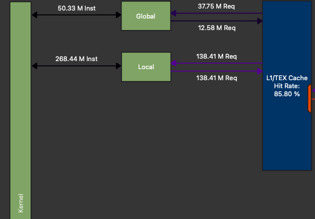

# (WIP) Six basic performance advices for porting kernels to the GPU.
_Last updated: {{ git_revision_date_localized }}_.  


## 0. Introduction
### Some context and motivations

I was hired by CEA to join the porting effort of this legacy code to the GPU using [Kokkos](https://github.com/kokkos/kokkos). This is quite a challenging task as the code is 20 years old, and more than 1400 kernels were identified to be ported to the GPU ! As I went and optimized some kernels, something struck me:

**The nature of the task of porting code to the GPU, especially when time is limited, often lead to small mistakes that can undermine performance.**

The goal of this blog-post is to give you *basic*, easy tips to keep in mind when writing / porting / first optimizing your kernels, so that you get a *reasonable* performance.

By applying them, I was able to get the following speedups that are measured relative to an already GPU-enabled baseline:

- A 40-50% speedup on a CFD [convection kernel](https://github.com/cea-trust-platform/trust-code/blob/509d09ae94bc5189131c6f160f1d42f6024cfa98/src/VEF/Operateurs/Op_Conv/Op_Conv_VEF_Face.cpp#L473) from TRUST (obtained on RTX A5000, RTX A6000 Ada and H100 GPUs). **Brace yourself**: this is a monstruous kernel.
- A 20-50% speedup on a CFD [diffusion kernel](https://github.com/cea-trust-platform/trust-code/blob/509d09ae94bc5189131c6f160f1d42f6024cfa98/src/VEF/Operateurs/Op_Diff_Dift/Op_Dift_VEF_Face_Gen.tpp#L192) from TRUST (obtained on RTX A6000 Ada and H100 GPUs).
- A 20% speedup on a [MUSCL reconstruction kernel](https://github.com/Maison-de-la-Simulation/heraclespp/blob/54feb467f046cf21bdca5cfa679b453961ea8d7e/src/hydro/limited_linear_reconstruction.hpp#L54) from the radiative hydrodynamics code [heraclescpp](https://github.com/Maison-de-la-Simulation/heraclespp) (obtained on a A100 GPU)
  
By *reasonable* I do not mean that you will get *optimal* performance. In fact, I will not go over what I consider to be *advanced* optimization advices such as the use of 

- [`shared memory`](https://www.youtube.com/watch?v=A1EkI5t_CJI&t=5s), 
- [vectorized operations](https://developer.nvidia.com/blog/cuda-pro-tip-increase-performance-with-vectorized-memory-access/),
- [tensor cores operations](https://developer.nvidia.com/blog/optimizing-gpu-performance-tensor-cores/),
- [hardware-specific optimizations](https://www.nvidia.com/en-us/on-demand/session/gtc25-s72683/?playlistId=playList-600dacf3-7db9-45fe-b0a2-e0156a792bc5). 
  
If getting  *optimal* performance is crucial to your application, consider learning more and apply these, but keep in mind that **performance often comes at the cost of portability**.
The advices are general enough so that they should allow speedups on all cards from all vendors.  By *advanced*, I do not mean that these topics are especially difficult or out of reach, but only that they require a significant design effort to be used effectively in a production context such as a wide CFD code like TRUST. In contrast, I believe that the advices I will give to you in this blog post are easy enough so that you can, and should apply them straightforwardly while porting your code to the GPU in a time limited environment. 

**Note 1:** The target audience is engineer / researcher that want to get started with GPU porting in a code that relies on custom, domain specific low-level kernel. But do not reinvent the wheel ! i.e. do not rewrite kernels that have been implemented, highly optimized and distributed in libraries. Consider looking into (non exhaustive list !):

- [CUDA Libraries](https://docs.nvidia.com/cuda-libraries/index.html).
- [kokkos kernels](https://github.com/kokkos/kokkos-kernels) for portable BLAS, sparse BLAS and graph kernels.
- [Trilinos](https://trilinos.github.io/) for high level, portable solutions for the solution of large-scale, complex multi-physics engineering and scientific problems.
- [PETSc](https://petsc.org/release/) for the scalable solution of scientific applications modeled by partial differential equations (PDEs)

### Disclaimers

If you think I wrote something that is wrong, or misleading please let me know !

I am running my performance tests on Nvidia GPUs, just because they are more easily available to me, and that I am more familiar with the performance tools such as [nsight systems](https://developer.nvidia.com/nsight-systems) (nsys) and [nsight compute](https://developer.nvidia.com/nsight-compute) (ncu). However, note that AMD provides similar profilers (altough, at the time I am writing this, rocm's kernel profilers seem a lot less user friendly), and that the advices that I give here are general enough so that they apply for GPUs from both vendors.

I am heavily biased towards memory-related optimization as the TRUS ccod

Moreover, I will use Kokkos as the programming model for the code sample, just because I work with it, and that performance portability is **cool**. Again, the concepts are simple enough so that you can translate them to your favorite programming model, OpenMP, SYCL, Cuda, Hip.

### prerequisites

In this tutorial, I will assume that you are already familiar with:

- Basic C++.
- The reason why you might want to use the GPU, and that you need a big enough problem to make full use of it.
- Some understanding of GPU performance:
    - The roof-line performance model.
    - What does compute bound / memory bound mean.
- Basic GPU architecture, in particular:
    - Some knowledge about the memory hierarchy (registers, L1/L2 caches, DRAM) and the increasing cost of memory accesses.
    - What are CUDA threads / blocks, global memory. *You can be confused about what is local memory*.
    - Some resources on GPU architecture / CUDA programming:
        - The refresher below,
        - [1h30 lecture by Athena Elfarou (Nvidia)](https://www.nvidia.com/en-us/on-demand/session/gtc24-s62191/),
        - [13 lectures by Bob Crovella (Nvidia)](https://www.youtube.com/watch?v=OsK8YFHTtNs&list=PL6RdenZrxrw-zNX7uuGppWETdxt_JxdMj).

Although not necessary for getting through this post, I recommend you learn about:

- How to compile a GPU code, generate a report with [Nvidia nsight compute](https://youtu.be/04dJ-aePYpE?si=wTO9vJsRmVMBfM8a) and loading in with the ui.
- Application-level optimization:
    - How to build a sensible optimization road-map with e.g. Nvidia Nsight System
    - That you should avoid host to device memory transfers; This tutorial is centered on kernel-level optimization. We assume memory is already available on the GPU
    - How to ensure that it is worth it to optimize the kernel you are looking (Don't assume bottleneck, profile, assess, optimize).
    - Some resources:
        -  [8th lecture from the Bob Crovella (Nvidia) lecture series](https://www.youtube.com/watch?v=nhTjq0P9uc8&list=PL6RdenZrxrw-zNX7uuGppWETdxt_JxdMj&index=8) which focuses on that topic.
- What is Kokkos, why you might want to use it and how to get started with it. Some resources:
    - [Talk](https://www.youtube.com/watch?v=y3HHBl4kV7g) by Christian Trott, Co-leader of the Kokkos core team (Sandia National Lab).
    - [Kokkos lecture series](https://www.youtube.com/watch?v=rUIcWtFU5qM&list=PLqtSvL1MDrdFgDYpITs7aQAH9vkrs6TOF) (kind of outdated, but you can find a lot of resources online, alos, join the slack !).
    -  **Note:** you really *should* consider using Kokkos, or any other portable programming model. It's good enough so that CEA adopted it for it's legacy codes ! (see [the CExA project](https://cexa-project.org/)).
### Outline

The outline for this post is the following six rules of thumbs,or advices, largely inspired by [the Nvidia Ampere tuning guide](https://docs.nvidia.com/cuda/ampere-tuning-guide/index.html):

1. Minimize redundant global memory accesses.
2. Avoid the use of *Local memory*.
3. Minimize redundant math operation, use cheap arithmetic.
4. Avoid thread divergence.

Feel free to jump straight into your sections of interest. One of the main interest of this tutorial is to teach you *where* to look for information in ncu. Look for "Profiler diagnosis" sections.

### Before we start

Before going into the six advices, I invite you to read [my post on the cost of communications](post2.md) that is a good, unnecessary long introduction for advices 1. and 2. I also strongly advise watching [this brilliant talk on communication-avoiding algorithms](https://www.youtube.com/watch?v=sY3bgirw--4). 

All sample code and ncu reports can be found [here](https://github.com/rbourgeois33/rbourgeois33.github.io/tree/code-sample/code-sample) along with compilation and execution instructions. The reports were ran on my [Nvidia RTX 6000 Ada generation](https://www.techpowerup.com/gpu-specs/rtx-6000-ada-generation.c3933) GPU.

Lastly, here is a refresher on the separation of hardware and software concepts when programming Nvidia GPUs with CUDA:

**Figure 8:** Software / hardware memory hierarchy of an Nvidia GPU. [source](https://www.nvidia.com/en-us/on-demand/session/gtc24-s62191/). 

The GPU hardware is organized as follows:

- A GPU is made of an aggregation of Streaming Multiprocessors (SM) that contains the computational units. This is where the computations are done. Instructions are scheduled as so-called warps of size 32.
- The DRAM (slowest memory access, limited by the bandwidth), accessible by all Streaming Multiprocessors (SM),
- the L2 cache, much smaller than the DRAM but faster, accessible visible by all SMs,
- One L1 cache by SM, much smaller than the L2 but faster,
- A register file per SM, much smaller than the L1 but the fastest.

The software is organized as follows:

- Threads are uniquely defined sequences of operations defined by the CUDA kernels. They reside on the SM's.
- Blocks of threads. Threads of a block only reside in the same SM.
- Global memory. Visible by all threads, may reside in DRAM, L2 or L1 (potentially very slow !)
- Shared memory. Visible by all threads of a block, managed by the developer. Resides in L1.
- **Local memory.** Private to a thread, may reside in DRAM, L2 or L1 (potentially very slow !). Local memory includes both register spilling and stack usage. More on that in section 2.
- Registers. Private to a thread, resides in the SM's register file (the fastest !). 
### Detect and avoid stack usage

## 1. Minimise redundant global memory accesses

On an Nvidia GPU, any request to global memory may end up fetching data from:

- The DRAM, visible by all threads
- The L2 cache, visible by all threads
- The L1 cache, visible by all threads of a block

As discussed in [my post on the cost of communications](post2.md), on recent GPUs (V/A/H/B100) it takes 50-100x more time to load a non cached FP64 double from DRAM up to registers than computing a FMA math operation on that number. I call this ratio the **flop per load** (FPL). The cache hierarchy does mitigates that number. If the L1 cache hits, the memory request will be much faster, with a FPL of "only" 2-5x. For the L2 cache, the factor is about 5-10x. But it remains that every access to global memory *is* more expensive than a register manipulation by a factor of at least 2-5x. Thus you should avoid them *at all cost*.

### 1. Minimize redundant thread-level global memory accesses

#### A first simple example, temporary register storage
Let's considers at [sample-1.cpp](https://github.com/rbourgeois33/rbourgeois33.github.io/blob/code-sample/code-sample/sample-1.cpp) where we create two Device views:
If you are not familiar with Kokkos views, in this context, they are just containers for vectors that resides on the GPU.
```c++
const int size = 1<<27;
Kokkos::View<float*> A("A", size);
Kokkos::View<float*> B("B", size);
```
and perform the following, rather silly, kernel,
```c++
Kokkos::parallel_for("Kernel", size, KOKKOS_LAMBDA(const int i) { 
    for (int k=0; k<10; k++){
        A(i) += B(i-1);
        A(i) += B(i);
        A(i) += B(i+1);
    }
});
```
The issue is probably already striking to you: each instance of `A(i) +=` is a global memory R/W. The solution is straightforward and found in [sample-1-fixed.cpp](https://github.com/rbourgeois33/rbourgeois33.github.io/blob/code-sample/code-sample/sample-1-fixed.cpp): use a temporary storage for `A`, and R/W only once per thread:

```c++
Kokkos::parallel_for("Kernel", size, KOKKOS_LAMBDA(const int i) { 
    float tmp=0;
    for (int k=0; k<10; k++){
        tmp += B(i-1);
        tmp += B(i);
        tmp += B(i+1);
    }
    A(i) += tmp;
});
```
**Note**: Since each thread uses the same values of B as it's neighbors, `shared memory` could be used to further improve performance. However, this kernel is simple enough so that caches probably already do a enough good job.

With this simple change, we went from 60R, 30W per thread to 31R, 1W. You might think that it is such an obvious thing to avoid that it is not even worth talking about it. But I disagree ! Often, when first porting to Kokkos, in a time limited environment, we simply replace the e.g. `std::vector` by `Kokkos::View` in the kernel body, check functionality and move onto the next kernel, resulting in this issue hindering performance. Moreover, for more very long, intricate kernels with many Views, spotting and   removing redundant memory accesses is quite tedious. Try for e.g. [this one](https://github.com/cea-trust-platform/trust-code/blob/509d09ae94bc5189131c6f160f1d42f6024cfa98/src/VEF/Operateurs/Op_Conv/Op_Conv_VEF_Face.cpp#L473).
#### Profiler diagnosis
Let's look into the profiler report for the first sample code (Download it and load it in ncu ! Works even if you don't have a Nvidia GPU), [sample-1.ncu-rep](https://github.com/rbourgeois33/rbourgeois33.github.io/blob/code-sample/code-sample/sample-1.ncu-rep). First, let's look at the GPU SOL section:

**Figure 1:** GPU SOL section for sample-1.cpp.

We can see that the memory is heavily used. This begs the question, are we using it effectively ? Let's go to the memory workload analysis and dissect some elements

**Figure 2:** Memory workload analysis for sample-1.cpp.

- Memory Throughput [Gbyte/s] 308.75 
    - --> This is much lower than my GPU's bandwidth of 960.0,
- Communications between DRAM (Device Memory) and L2:
    - 1.07 GB reads, which corresponds to $2^{27}(\text{size}) \times 2 (\text{A and B}) \times 4 (\text{bytes per double})=1.07\times 10^9$ bytes. There is half as much writes, corresponding to A being modified. Both A and B are loaded once into the L2 cache, and A is written back only once into DRAM Good !
- Communications between L2 and L1:
    - About as much reads into L1, a little more probably due to cache misses. But, an astounding 9.14 GB of data written from L1 to L2, due to cache invalidation ! This  is a great hint of redundant memory accesses; a big discrepancy between expected and observed volumes of exchanges. Essentially, this is the cache that is working hard to save you from you own mistakes, by not writing back all the way to DRAM at each `A(i)+=`. It really is saving you, as if we switch to throughput view, we see that these excessive writes are done at an astounding 1.89 TB/s, twice as fast as my GPU's bandwidth !
  
Lastly, let's look at one of my favorite sections, the warp state statistics session, especially the warp states:

**Figure 3:** Warp States for sample-1.cpp.
If you are not familiar with warps states, really consider looking at [the 1h30 lecture by Athena Elfarou (Nvidia)](https://www.nvidia.com/en-us/on-demand/session/gtc24-s62191/). Essentially, a warp is a group of 32 threads (32 instances of the kernel with neighboring index `i`). It can be either:

- Stalled: waiting on a dependency: for instance, to perform `A(i)+=B(i)`, you need to wait that both values were loaded from global memory into the registers. This takes a while. You can also be waiting on a math operation to be done, a barrier, or the execution queue to have a spot.
- Eligible: available to be scheduled,
- Selected: will issue an instruction on the next cycle.
  
The warp states shows you the **reasons** why your warps have been stalled during the execution of your kernel, sorted by importance. This is precisely what you should worry about ! We see two reasons here with quite obscure names "Stall long scoreboard and Stall LG throttle". You can drag over your mouse onto the items to get an explanation, e.g. for the first one:
.jpg)

**Figure 4:** Metric information for Stall long scoreboard.

Stall long scoreboard means that warps are waiting on a memory dependency from global memory, this not surprising and a very common one for memory bound kernels. Stall LG throttle means that the warps are waiting on the warp slot queue to have a spot to be scheduled. Indeed, each warp scheduler has a finite amount of spots for it's warps to be scheduled. If a kernel issues too many requests, warps are waiting, not on a dependency, but simply on a spot in the queue. This is also a good symptom of redundant memory operations !

Let's now take a look at [sample-1-fixed.ncu-rep](https://github.com/rbourgeois33/rbourgeois33.github.io/blob/code-sample/code-sample/sample-1-fixed.ncu-rep). I recommend using the "add baseline" functionality, so that we can track our progress ! First thing you can notice is that we get a huge performance gain: from 5.08ms to 1.81ms, a 64% speedup ! Then, going into the several sections:

- GPU Speed of light throughput:
    - The compute pipeline is less busy, I'm honestly not sure why.
    - The memory pipeline is more used (+6%)
  

**Figure 5:** Memory workload analysis for sample-1-fixed.cpp.

- Memory workload Analysis: 
    - The memory throughput is much closer to the theoretical peak (865 GB/s, +180%)
    - The previously healthy memory transfers are unchanged, but the L1 to L2 writes are reduced by 94%, as well as the caches hit rates. This shows that our cleaner implementation relies less on the caches, because it has much fewer redundant memory accesses.


<!-- We can see that the kernel uses both memory and compute pipelines extensively. The high value of memory usage is surprising; Each thread is performing a lot of math; around 30 FMA, but is is much lower than the FP32 FPL of the GPU I am working with (A [Nvidia RTX 6000 Ada generation](https://www.techpowerup.com/gpu-specs/rtx-6000-ada-generation.c3933), with a FP32 FPL of 379) -->
<!-- - 255.85M request between the kernel and global memory, split amongst ~130M Reads and ~130M Writes.
    - This corresponds to $2^{27}(30) -->
#### Static arrays as temporary storages
Let's now consider a multi-dimensional case, with 2D Views and at least one run-time axis size, here, `dim`:

```c++
const int size = 1<<27;
int dim = 3;
Kokkos::View<float**> A("A", size, dim);
Kokkos::View<float**> B("B", size, dim);
```

and the following kernel from [sample-2.cpp](https://github.com/rbourgeois33/rbourgeois33.github.io/blob/code-sample/code-sample/sample-2.cpp):

```c++
Kokkos::parallel_for("Kernel", size, KOKKOS_LAMBDA(const int i) { 
    for (int k = 0; k < 10; k++){
        for (int dir = 0; dir < dim; dir++){
            for (int dir2 = 0; dir2 < dim; dir2++){
                A(i,dir) += B(i,dir2);
            }
        }
    }
});
```

It is clear that there are redundant memory accesses, that we would like to store in a array residing in registers as follows:

```c++
Kokkos::parallel_for("Kernel", size, KOKKOS_LAMBDA(const int i) { 
        
    float Atmp[dim], Btmp[dim];

    for (int dir = 0; dir < dim; dir++){
        Atmp[dir] = A(i, dir);
        Btmp[dir] = B(i, dir);
    }

    for (int k = 0; k < 10; k++){
        for (int dir = 0; dir < dim; dir++){
            for (int dir2 = 0; dir2 < dim; dir2++){
            Atmp[dir] += Btmp[dir2];
            }
        }
    }

    for (int dir = 0; dir < dim; dir++){
        A(i,dir) = Atmp[dir];
    }
});
```
 However, `dim` is a run-time variable, while arrays must be declared with compile time-value. In this case, this generate a compile error. If you somehow manage to get a run-time sized vector in your kernel and avoid a compilation error, you will at best get a slow runtime, as it will reside in local memory, cf. section 2. The solution is to wrap the kernel in a `dim`-templated function, as done in [sample-2-fixed.cpp](https://github.com/rbourgeois33/rbourgeois33.github.io/blob/code-sample/code-sample/sample-2-fixed.cpp):

```c++
template<int dim>
void apply_kernel(Kokkos::View<float**> A,  Kokkos::View<float**> B, int size){

    Kokkos::parallel_for("Kernel", size, KOKKOS_LAMBDA(const int i) { 
    // ... the previous kernel ...
    });
}
```

which can be called as follows, where dim is picked at runtime:

```c++
if (dim==1){
    apply_kernel<1>(A, B, size);
} else if (dim==2){
    apply_kernel<2>(A, B, size);
} else if (dim==3){
    apply_kernel<3>(A, B, size);
} else{
   // Need more instantiations ! Fail or warning 
}
```


I will not go through the ncu reports for this second example as the behavior is really similar to sample-1, but feel free to look a them yourself. The speedup obtained is 75% which is not surpising, since I pick the examples.

**Warning:** Note that when using static arrays as temporary storage, you might accidentally trigger *Local memory* usage as it may resides in the stack. Please the section 2 to avoid this !

### Minimize block-level redundant memory accesses: `shared memory`
If you spot that neighboring threads (that likely reside on the same block) are using extensively the same elements from global memory, I strongly suggest you learn more about `shared-memory`, to reduce redundant **block-level** memory accesses. `shared-memory` is essentially a portion of the L1 cache managed by the user. L1 cache is the fastest cache, right before registers, that is shared by threads of a block. But beware, using it means that you think you can do a better job than the runtime ! :). To use shared memory in Kokkos, look at [Hierarchical Parallelism](https://kokkos.org/kokkos-core-wiki/ProgrammingGuide/HierarchicalParallelism.html). As mentionned in the introduction, I do not wish to delve deeper on this topic in this tutorial.

### Minimize redundant kernel-level memory accesses: coalescing

#### sectors and cache line
When using Nvidia GPUs, threads are packed in so-called warps of 32 threads which execute instructions simultaneously (SIMD). In the same way, when a memory request if performed, (like load one FP64 number from global memory), it is not done for a single one, but in packs of so-called *sectors* of 32 bytes (i.e. 4 FP64 numbers). Another way to say this is that the memory access granularity of the GPU is of 32 bytes. As a result, the best case scenario for a warp load, is that it requires data that is coalescing:


**Figure 6:** Coalesced memory accesses [Source](https://www.nvidia.com/en-us/on-demand/session/gtc24-s62191/). 

In this ideal case, each thread is loading a FP64 number. There are 32 threads in a warps so this amount to 32 FP64 number, e.g. 256 bytes which is 8 sectors. This is very efficient because 256 bytes are loaded, and 256 bytes are used: the bandwidth of the GPU is fully used. Let's now look at the worst case scenario:


**Figure 7:** strided memory accesses. Adapted from [source](https://www.nvidia.com/en-us/on-demand/session/gtc24-s62191/). 

In this case, each thread requires is also loading a FP64 numbers, but there is a sector-wide stride between threads. Since a FP64 number cannot be loaded "on it's own", a whole sector is loaded for each. As a result 32 sectors = 1024 bytes are loaded, for only 256 bytes used. This means that only a quarter of the bandwitdh is used, and the case gets worst if you are working with smaller a datatype.

#### Profiler diagnosis

The ratio of bytes loaded to bytes used per memory request is actually shown in the memory workload analysis. For example, for [sample-1-fixed.ncu-rep](https://github.com/rbourgeois33/rbourgeois33.github.io/blob/code-sample/code-sample/sample-1-fixed.ncu-rep), we can see:

**Figure 5:** DRAM Global Load Access Pattern warning for `sample-1-fixed.cpp`.

where we see that for each 32 bytes sector transmitted, "only" 28.4 are used. This is pretty good of course as this code is very simple. But for more complicated operations, such as numerical simulation on unstructured meshes, this can be very bad. This section of ncu is helpful to detect that precise issue.

#### Advices
These observations should make you want to think about your data layout. In particular, **you should organize your data so that neighboring threads are working on neighboring data**. This means that there is not one good general answer on which storage is better for a dense matrix, row-major or column-major. If you are doing matrix-vector product, sure, row-major is better as it will be more cache friendly. If you do matrix-transpose-vector product, you want column-major. In the same way, there is no definitive better answer to the debate Array of Structure vs. Structure of Array. It all depends on what you will be doing with the you data, how you will iterate over it. In other words, **match your data layout with your iteration layout**. You will hear people say things like *"LayoutLeft (column-major) is best on GPU, LayoutRight (row-major) is best on CPU"*. This is **not** a general truth.<!--- It might be the case for specific codes that work on arrays of specific size, for instance `A[M][N]` with $M\gg N$ and a specific type of operations on it. But this cannot be taught as a generality  ---> Let's look at an example:

Consider a matrix `A` of size, `NxN` and the following two kernels:

1. compute `col`, a vector of `N` elements defined as the sum of each columns of `A`, by assigning each column to a thread,
2. compute `row`, a vector of `N` elements defined as the sum of each rows of `A`, by assigning each row to a thread.

**Note:** This is quite a bad way to parallelize this computation.

For kernel 1, storing `A` as column-major is better. Each thread is accessing a column which is a coalesced memory segment. If one uses row-major storage, we can expect terrible performance. The opposite argument applies for kernel 2. It will be fast for LayoutRight storage, and slow for LayoutLeft. In [sample-3.cpp](https://github.com/rbourgeois33/rbourgeois33.github.io/blob/code-sample/code-sample/sample-3.cpp), we perform kernels 1 and 2 on a LayoutLeft Kokkos View:

```c++
int N = 10000; 
Kokkos::View<float**, Kokkos::LayoutLeft>   A_LL("A_LL", N, N);      
Kokkos::View<float**, Kokkos::LayoutRight>  A_LR("A_LR", N, N);       
Kokkos::View<float*> row_sum("row_sum", N); 

// [...]

Kokkos::parallel_for("RowSumLL", N, KOKKOS_LAMBDA(int i) {
    float sum = 0.0;
    for (int j = 0; j < N; j++) {
        sum += A_LL(i,j);
        }
    row_sum(i) = sum;
});

Kokkos::parallel_for("RowSumLR", N, KOKKOS_LAMBDA(int i) {
    float sum = 0.0;
    for (int j = 0; j < N; j++) {
        sum += A_LR(i,j);
    }
    row_sum(i) = sum;
});
```
The report can be found at [sample-3.ncu-rep](https://github.com/rbourgeois33/rbourgeois33.github.io/blob/code-sample/code-sample/sample-3-fixed) in which we can see that:

- `ColSumLL` runs in 0.52 ms,
- `RowSumLL` runs in 1.14ms (+120%), and the memory workload analysis section says: *"On average, only 4.0 of the 32 bytes transmitted per sector are utilized by each thread"*. Moreover, the L1 cache is used a lot, whereas `ColSumLL` does not use it at all.

As you see, the best layout depends on what *operation* you plan on doing on your data, and *how* you plan on doing it. Another example is matrix multiplication where the best layout is cache/register-fitting blocked layout, *because* the best algorithm is cache/register-fitting blocked matrix multiplication. If you were to implement the naive version of matrix multiply `C=AB` where, for each element of `C`, you load a row of `A` and a column of `B` and perform the dot product, the best layout is storing `A/B` in row/column-major order respectively. For simulations on unstructured meshes, I recommend using [Z-order curve](https://en.wikipedia.org/wiki/Z-order_curve) re-ordering of the mesh-element. For our CFD code TRUST, this enabled an overall +20% speedup due to a better coalescing.

**Note:** Non-coalesced write are worst in performance that non-coalesced read, as a write needs to invalidate caches, we say that writes are "cache-through". A single non-coalesced write can invalidate a sector in L1, and L2, requiring the data to be fetched potentially all the way from DRAM for the next load.

**Note:** The default layout for multidimensional views in Kokkos is LayoutLeft on device, and LayoutRight on host. I believe this is due to historical reasons; Algorithms from the Trilinos library that is built upon Kokkos runs more efficiently this way. But again, this is application-specific.

## 2. Avoid the use of local memory
### What is local memory, how to detect it's usage.
As we saw in the introduction's refresher, local memory is private to a thread and may reside in DRAM, L2 or L1, which is potentially very slow, and in any case much slower than registers. Local memory usage happens in two cases:

- when the "stack" is used,
- when register spilling happens.

We will try to understand both and remove them from our kernels. One good thing about both of these is that the decision of using them is made at *compile-time* by nvcc. As a result, using the compile right flag (`-Xptas -v`), one can detect it easily, without having to run / profile the code. The flags are used in the sample code's [CMakeLists.txt](https://github.com/rbourgeois33/rbourgeois33.github.io/blob/code-sample/code-sample/CMakeLists.txt), and each kernel compilation produces such an output:
```
ptxas info    : Compiling entry function '[verbose Kokkos mangled name]' for 'sm_89'
ptxas info    : Function properties for [verbose Kokkos mangled name]
    24 bytes stack frame, 0 bytes spill stores, 0 bytes spill loads
ptxas info    : Used 28 registers, used 0 barriers, 24 bytes cumulative stack size, 
                    512 bytes cmem[0]
ptxas info    : Compile time = 5.300 ms
```

if `bytes stack frame` is greater than 0, you are using the stack. If either `bytes spill stores` or `bytes spill loads`are greater than 0, register spilling is happening.

### Avoid stack usage
#### Precautions when using static arrays for temporary storage
In my experience, stack usage typically arises when using static arrays for temporary storage to reduce redundant thread-level global memory accesses. This is especially the case when the array is indexed at runtime in a way that the compiler cannot resolve at compile time. Because the compiler cannot predict the access pattern, it places the array in local memory, which provides the necessary flexibility for dynamic indexing despite terrible performances. Let's look at a mock example:

```c++
// Within a GPU kernel, thread id is i
double tmp[3]
tmp[2] = ... //OK ! resolvable at compile time
int index = view_with_indexes_in_it(i) 
tmp[index] = .. //Not OK ! Compiler cannot resolve this. It cannot compute the value of index. tmp now resides in local memory
```
the solution is quite disappointing in my opinion, but necessary, if you are sure that values from `view_with_indexes_in_it(i)` are in $[0,2]$, then, you can apply a switch, i.e. replace the last line by:
```c++
switch(index){
    case 0:
        tmp[0]=...; break;
    case 1:
        tmp[1]=...; break;    
    case 2:
        tmp[2]=...; break; 
    default:
        //Error 
}
```
This can also happens when static arrays are used in loops that cannot be unrolled:
```c++
    int bound=3;
    Kokkos::parallel_for("Kernel", size, KOKKOS_LAMBDA(const int i) { 
        float tmp[3];  
        // some stuff
        for (int k=0; k<bound; k++){ 
          tmp[k] += A(i+k);
        }
       // some stuff
    });
```
in this piece of code, `bound` is a non-const, runtime variable that nvcc cannot deduce when compiling the kernel. Therefore, `tmp` is not statically addressed and has to reside in local memory. Try compiling [sample-5.cpp](https://github.com/rbourgeois33/rbourgeois33.github.io/blob/code-sample/code-sample/sample-4.cpp) as it is, and after adding a `const` clause in `bound`'s declaration, and observe the difference in the output pf `Xptas`.

#### Profiler diagnosis
Let's look at a [sample-4.cpp](https://github.com/rbourgeois33/rbourgeois33.github.io/blob/code-sample/code-sample/sample-4.cpp) that resembles sample-2, but with and indirection table that is filled

```c++
Kokkos::View<int**> indirections("indirections", size, dim);
Kokkos::parallel_for("fill indirections", size, KOKKOS_LAMBDA(const int i) { 
    for (int dir = 0; dir < dim; dir++){
        indirections(i, dir) = (dir+1)%dim; 
    }
});
```
such that it contains values in $[0, \text{dim}]$. Then, the table is used in the kernel:
```c++
template<int dim>
void apply_kernel(Kokkos::View<float**> A,  Kokkos::View<float**> B, Kokkos::View<int**> indirections, int size){
Kokkos::parallel_for("Kernel", size, KOKKOS_LAMBDA(const int i) { 
        
        float Atmp[dim], Btmp[dim];
        int indir[dim];

        for (int dir = 0; dir < dim; dir++){
            indir[dir] = indirections(i, dir);
           // ... same as sample-2
        }
        for (int k = 0; k < 10; k++){
            for (int dir = 0; dir < dim; dir++){
                for (int dir2 = 0; dir2 < dim; dir2++){
                    Atmp[indir[dir]] += Btmp[dir2]; //Not OK ! Compiler cannot resolve this. 
                    // It cannot compute the value of index. tmp now resides in local memory
                }
            }
        } 
        // ... same as sample-2
    });
}
```
The compilation produces the following compiler output:
```
ptxas info    : Compiling entry function '[verbose Kokkos mangled name]' for 'sm_89'
ptxas info    : Function properties for [verbose Kokkos mangled name]
    16 bytes stack frame, 0 bytes spill stores, 0 bytes spill loads
ptxas info    : Used 28 registers, used 0 barriers, 16 bytes cumulative stack size, 
                    512 bytes cmem[0]
ptxas info    : Compile time = 103.683 ms
```
To fix this, we use a switch in [sample-4-fixed.cpp](https://github.com/rbourgeois33/rbourgeois33.github.io/blob/code-sample/code-sample/sample-4-fixed.cpp):
```c++
switch (indir[dir]){
    case 0:
        Atmp[0] += Btmp[dir2];
        break;
    case 1:
        Atmp[1] += Btmp[dir2];
        break;
    case 2:
        Atmp[2] += Btmp[dir2];
        break;
}
```
which fixes the issue, as seen in the logs:
```
    0 bytes stack frame, 0 bytes spill stores, 0 bytes spill loads
ptxas info    : Used 24 registers, used 0 barriers, 512 bytes cmem[0]
```
Now, comparing the ncu reports [sample-4.ncu-rep](https://github.com/rbourgeois33/rbourgeois33.github.io/blob/code-sample/code-sample/sample-4.ncu-rep), [sample-4-fixed.ncu-rep](https://github.com/rbourgeois33/rbourgeois33.github.io/blob/code-sample/code-sample/sample-4-fixed.ncu-rep) we can see that:

- The fixed version is 32% faster (6.98ms vs 10.37 ms).
- both compute and memory pipelines are used much more effectively in the fixed version (see SOL)
- the warps are much less stalled for "stall long scoreboard" i.e. waiting on local memory dependency for the fixed version
- The memory workload analysis allows to track local memory usage. For the fixed version, it's 0, while we see for the base version:

**Figure 8:** Local memory usage in ncu for [sample-4.ncu-rep](https://github.com/rbourgeois33/rbourgeois33.github.io/blob/code-sample/code-sample/sample-4.ncu-rep).
 - Lastly, the source view allows to track the line(s) responsible for local memory usage:
  
**Figure 9:** Local memory usage localization in ncu's source view for [sample-4.ncu-rep](https://github.com/rbourgeois33/rbourgeois33.github.io/blob/code-sample/code-sample/sample-4.ncu-rep).

### Avoid register spilling
Register spilling happens when threads are requiring too much register, so much so that it hinders occupancy in such an extreme way that the compiler decides to "spill" the memory that should initially be in registers, into slow local memory. Therefore, advices on improving occupancy by reducing register usage will help avoiding register spilling. As a result, we refer to the next section.


## 3. Improve occupancy
Hide latency The occupancy trap, ILP, hide latency reduce Register usage
Reduce usage, launch bound, no MDRANGE, we dont talk about block and share memory limits, template away expensive branches
Why does it spills . Parfois il faut
### Background
### Profiler diagnosis
### Advices

## 4. Minimize redundant math operation, use cheap arithmetics
### Background
### Profiler diagnosis
### Advices
FMA, / vs *, unroll loop for int computation might need to template Math can be a bottleneck  Do smarter math


## 5. Avoid thread divergence
### Background
### Profiler diagnosis
### Advices
The SIMD pattern, masking templating

## Final advices

Participate to hackathons !

