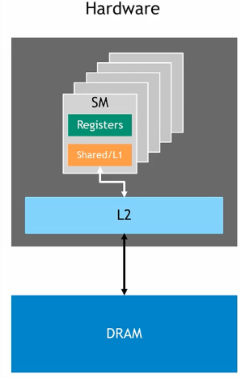
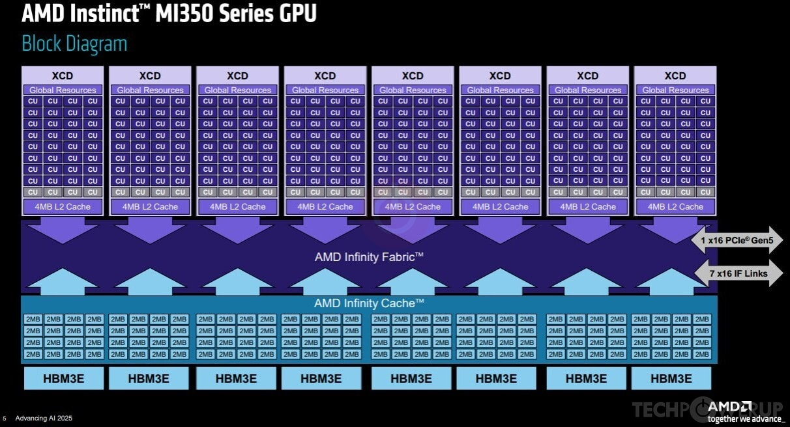
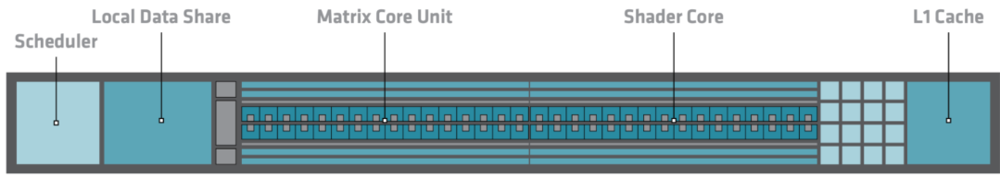

# Architectural differences between AMD and Nvidia recent server GPUs
If you find this article useful, leave a thumbs up or a comment [below](#comments)!

_Last updated: {{ git_revision_date_localized }}_.  

## 0. Introduction
### Motivations
The goal of this article is to give a bird's-eye view of the principal architectural differences between recent AMD and Nvidia server GPUs and their implications on:

- performance we might observe when switching vendors,
- how we should program them.

It should be particularly useful to people who are comfortable with Nvidia's architecture and profiling tools and plan to work with AMD. Indeed, I believe that understanding the GPU architecture is a prerequisite to understanding the kernel profilers. In particular, I hope this post helps readers getting one of the *advanced* pre-requisite of the [Performance Profiling on AMD GPUs guide](https://rocm.blogs.amd.com/software-tools-optimization/profiling-guide/intro/README.html#performance-profiling-on-amd-gpus-part-1-foundations):

> The reader understands the architectural differences between AMD GPUs and competing hardware, including variations in memory hierarchy, compute units, and execution models.

Please let me know if you think something is missing!

### Nomenclature

When switching between AMD and Nvidia specs, it is easy to get confused by nomenclature. Here are the main correspondences relevant to this article:

- AMD's Compute Units (CU) / Nvidia's Streaming Multiprocessors (SM): The "cores" of the GPU, where compute happens.
- AMD's Local Data Share (LDS) / Nvidia's shared memory: Programmable cache located on the CU/SM.
- AMD's wavefront / Nvidia's warp: Groups of threads executed on the CU/SM.

### Some specifications
| GPU (Release) | RAM   (GB) | SM/CU   count | BW   (TB/s) | L1 Cache + Shared/LDS   per SM/CU (KB) | L2 Cache   Total (MB) | L3 Cache   (MB) | XCD Count   (= L2 Count) |
|---|---|---|---|---|---|---|---|
| [A100 (2020)](https://images.nvidia.com/aem-dam/en-zz/Solutions/data-center/nvidia-ampere-architecture-whitepaper.pdf) | 40 | 128 | 1.5 | 192 (combined) | 40 | -- | -- |
| [MI250X, CDNA2 (2021)](https://www.olcf.ornl.gov/wp-content/uploads/03-MemoryHierarchy.pdf) | 128 | 208 | 3.2 | 16 (L1) + 64 (LDS) = 80 | 16 | -- | -- |
| [H100 (2022)](https://resources.nvidia.com/en-us-hopper-architecture/nvidia-h100-tensor-c?ncid=no-ncid) | 80 | 132 | 3.0 | 256 (combined) | 50 | -- | -- |
| [MI300X, CDNA3 (2023)](https://www.amd.com/content/dam/amd/en/documents/instinct-tech-docs/white-papers/amd-cdna-3-white-paper.pdf) | 192 | 304 | 5.3 | 32 (L1) + 64 (LDS) = 96 | 32 | 256 | 8 |
| [B200 (2024)](https://docs.nvidia.com/cuda/blackwell-tuning-guide/index.html) | 180 | 148 | 8.0 | 256 (combined) | 126 | -- | -- |
| [MI350X, CDNA4 (2025)](https://www.amd.com/content/dam/amd/en/documents/instinct-tech-docs/white-papers/amd-cdna-4-architecture-whitepaper.pdf) | 288 | 256 | 8.0 | 32 (L1) + 160 (LDS) = 192 | 32 | 256 | 8 |

**Table 1:** Specifications of recent AMD & Nvidia server GPUs. Click GPU names for sources.

A few observations from this table. AMD GPUs:

- Are released roughly one year after their Nvidia counterparts and are traditionally cheaper,
- have more RAM, bandwidth, and SM/CU count,
- have less L1 & L2 cache and shared memory / LDS.

Starting with the MI300X, AMD GPUs also have an additional L3 cache absent from Nvidia GPUs. 

**Note:** I will not cover the dual-GCD design of the MI250X nor the MI300A APU, as neither appears to be continued in future AMD server GPU releases.

**Note:** From now, I will use the terminology *AMD GPUs* or *Nvidia GPUs*, omitting the fact that I only talk about recent server models.

## 1. Memory hierarchy

Let's start by looking at Nvidia GPU hardware hierarchy:

**Figure 1:** Hardware design of an Nvidia GPU. Credits: [Introduction to CUDA Programming and Performance Optimization](https://www.Nvidia.com/en-us/on-demand/session/gtc24-s62191/).

We can see that:

- An Nvidia GPU is an aggregation of SMs.
- Each SM has its own L1 cache, accessible only by that SM.
- All SMs share the same L2 cache and DRAM.

On the other hand, here is the AMD MI350X GPU block diagram:

**Figure 2:** Block diagram of an AMD MI350X GPU. Credits: AMD, Advancing AI 2025.

We observe:

- An AMD GPU is an aggregation of CUs.
- Each CU has its own L1 cache, accessible only by that CU.
- CUs are grouped into sets of 32 called XCDs; there are 8 XCDs per GPU.
- Each XCD has one L2 cache shared among its CUs.
- All XCDs share the same L3 "Infinity Cache" and DRAM.

The key difference is the additional XCD grouping and the corresponding L2/L3 split. Comparing AMD and Nvidia solely on L2 cache size is therefore misleading. Without workload-specific benchmarking, it is hard to declare one design better than the other. L1 and LDS/shared memory, however, occupy the same place in the hierarchy for both vendors. Those are worth examining closely.

## 2. LDS storage vs. shared memory

On Nvidia GPUs, L1 cache and shared memory share the same physical hardware on the SM. Allocating shared memory reduces the available L1 cache. Whatever is not reserved as shared memory is used as cache by default.

On AMD GPUs, LDS and L1 cache are separate pieces of hardware. See the CDNA3 CU below:

**Figure 3:** CDNA3 Compute Unit. Credit: [CDNA 3 whitepaper](https://www.amd.com/content/dam/amd/en/documents/instinct-tech-docs/white-papers/amd-cdna-3-white-paper.pdf).

The key consequence is that **on AMD GPUs, unused LDS remains idle during computation.** As noted by [Kotra et al. 2021 (AMD)](https://dl.acm.org/doi/pdf/10.1145/3466752.3480105):

> GPU's instruction cache (I-cache) and Local Data Share (LDS) scratchpad memory are under-utilized in many applications.

This under-utilization frequently hurts performance when porting code from Nvidia to AMD, especially when the code relies a lot on caches. The issue is reinforced by AMD's L1 cache being smaller than both the LDS and Nvidia's L1. As the [CINES porting and optimization guide](https://dci.dci-gitlab.cines.fr/webextranet/porting_optimization/index.html#guidelines) puts it:

> Don't forget about the Local Data Share (LDS). If you need caching, do not expect the GPU to do it for you — even if it partially works, you are likely leaving performance on the table versus using LDS explicitly.

The conclusion is that **using LDS storage / shared memory is more important and more rewarding on AMD than on Nvidia.**

## 3. Warp/wavefront size

In [my first blog post](https://rbourgeois33.github.io./posts/post1/#5-avoid-intra-warp-thread-divergence), I explain why it is important to avoid intra-warp thread divergence on Nvidia GPUs. Indeed, peak performance is obtained when the 32 threads of the warp go through the same logic branches, so that operations can be fully vectorized without masking.

On AMD CDNA GPUs, wavefronts are 64 threads wide, twice as large. As a result, poor vectorization can hinder performance more than on Nvidia GPUs. **Avoiding intra-warp thread divergence is more important and more rewarding on AMD than on Nvidia.**

## 4. Memory access granularity

In [my first blog post](https://rbourgeois33.github.io./posts/post1/#minimize-redundant-kernel-level-memory-requests-coalescing-accesses), I explain that on Nvidia GPUs you should organize your data and iteration pattern so that threads of the same warp access from the fewest sectors possible. Nvidia's sectors are the smallest chunks of memory that can be read from L2 to the SM and are 32 bytes long. Interestingly, a sector **is not** a cache-line. Sectors are 32 bytes wide on all Nvidia GPU models, regardless of the L1 cache line size (64/128 bytes). This is achieved by subdividing each L1 cache line into the sectors that share the line's tag, but have their individual status bit.

**Note:** If you are not familiar with caches, I recommend watching [BitLemon's YouTube Playlist on CPU caches](https://www.youtube.com/watch?v=wfVy85Dqiyc&list=PL38NNHQLqJqYnNrTenxBvGJSPCkV9EOWk&index=3). You will understand what write-through (L1) and write-back (Nvidia L2) caches are, and what the status bit is.

AMD does not document sectoring behavior. Therefore, the memory access granularity from L2 to the SM is likely equal to the L1 cache line size i.e. 64/128 bytes. As a result, AMD's memory access granularity is coarser than Nvidia's. **Avoiding uncoalesced accesses is more important and more rewarding on AMD than on Nvidia.**

## 5. (WIP) AMD Matrix Cores vs. Nvidia's Tensor cores

## 6. Conclusion
In this post, we briefly went over several architectural differences between AMD and Nvidia server GPUs. Going from Nvidia to AMD, one should not make quick assumptions about their inner workings. In particular:

- Unused LDS storage does not perform caching on AMD GPUs,
- AMD's wavefronts and memory access granularity are larger than on Nvidia.

Therefore, programming carefully to fully utilize the LDS and aligning memory accesses and instructions is **more important and more rewarding on AMD than on Nvidia.**

## 7. Bonus: TRUST's context
I work on the [TRUST platform](https://cea-trust-platform.github.io/), a HPC thermohydraulic simulation tool that runs on both AMD and Nvidia hardware thanks to the Kokkos library. Since our goal is to run on the next European exascale machine *Alice Recoque*, which will be built with AMD GPUs, we are getting very serious about performance on them. 

Historically, we have observed performance discrepancies on AMD vs. Nvidia hardware, relative to their bandwidth. Indeed, TRUST is memory-bound and relies heavily on sparse memory accesses (sparse linear algebra, unstructured meshes). Therefore, it benefits a lot from Nvidia's large default L1 caches, and suffers from AMD's strong preference for aligned accesses, small L1 caches and LDS storage being unused by default.

One good example is the variable performance gains I got from optimizing memory coalescing by working on the data layout on the GPU. This yields variable performance gains across GPUs:

- -12% runtime on an Nvidia Ada RTX 6000,
- -17% runtime on an AMD MI300A APU,
- -42% runtime on an AMD MI250X.

These are consistent with our observations, with the MI250X being the GPU with the smallest caches of the three. It also shows that with careful programming, any workload can be ran very effectively on AMD GPUs. Now, I think that our next move should be to make use of LDS at scale on our expensive kernels. If you have any experience using LDS/shared-memory to optimize sparse workloads, please reach out!

## Special thanks to:

- You, for reading !
- vector.sys for the valuable insights shared on the AMD developer Discord, as well as the review and precisions on HIP's hardware implementation of wavefronts.
- Aaron Jarmusch (Computational Research and Programming Lab, University of Delaware) for our discussion on Nvidia's sectors.

## Comments

